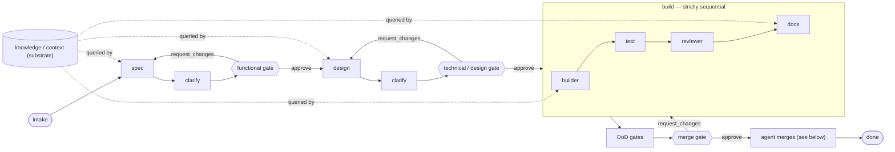

## Purpose

The orchestrator is maestro's conductor: it sequences the agent crew, owns delivery-task / gate / product state, and resolves reviewer routing. It exists as a separate container because the sequencing/gating logic must be reliable, recoverable, and free of LLM nondeterminism — so it contains **no LLM inference** (that lives in the crew, which reaches Claude only through the `ModelClient`).

## Responsibilities

**Owns:**
- The delivery-task lifecycle and `stage`/`status` transitions (see `data-model.md`).
- Gate creation, reviewer resolution via `config/reviewers.yaml` + product membership, and waiting for human decisions.
- Dispatching each stage to the correct agent and handling request-changes loops.
- Enforcing the safety boundary: it never invokes a merge or a default-branch push (ADR-0004).

**Does not own:**
- Any LLM reasoning — delegated to the crew (which calls the `ModelClient`).
- Talking to GitHub, Slack, or Telegram directly — delegated to the adapters (the surface layer for human control; ADR-0011).
- The merge decision — that is the human's, at the gate.

## Internal structure

| Component | Responsibility |
|-----------|----------------|
| `TaskCoordinator` | Drives a delivery task through its stages; the state machine over `DeliveryTask.stage` |
| `GateManager` | Creates gates, resolves surface + destination via `RoutingResolver`, delivers through the surface layer, waits for a decision from any eligible role-holder (quorum 1), records the decider, ignores actions from non-role-holders, applies approve/request-changes/reject |
| `RoutingResolver` | Pure function, never hardcoded (ADR-0003): resolves `(product_type, gate_type) → role` from the `config/reviewers.yaml` matrix, then `role → surface → destination group` (ADR-0011) — architect → the shared architect Slack channel; functional_reviewer → the product's Telegram group + bot from the register. Eligible deciders are the product's participants holding that role |
| `AgentDispatcher` | Invokes the right agent for the current stage from a **static stage→agent map** — no LLM picks the next agent (see [The agent workflow](#the-agent-workflow-stage--agent)); passes task + product context; agents reason via the `ModelClient` |
| `StateStore` | Persists task / gate / product state as an **append-only event log** (the source of truth); current state is a materialized projection, so the pipeline is recoverable across restarts via replay (ADR-0008). The product register is loaded read-only from `config/products.yaml`. |

## The agent workflow (stage → agent)

Agent selection is **deterministic and static**: the conductor dispatches the agent a stage maps to —
no LLM chooses who runs next. Keeping that nondeterminism out of the control flow is *why* the
orchestrator exists (ADR-0014). The crew ([`overview.md`](../overview.md)) maps to the `DeliveryTask.stage`
machine ([`data-model.md`](../data-model.md)) as:

| Stage | Agent(s) — in order | Produces | Then |
|-------|---------------------|----------|------|
| `intake` | — (orchestrator records the dispatched intent) | a `DeliveryTask` | → **spec** drafts |
| `functional_gate` (prep) | **spec** → **clarify** (read-only) | functional spec (EARS) + targeted clarify questions | → functional gate |
| `design` | **architect/planner** → **clarify** (read-only) | technical design + ordered tasks (+ ADR on a real trade-off) | → technical gate |
| `build` | **builder** → **test** → **reviewer** → **docs** — *strictly sequential* | code on a `maestro/*` branch + PR, spec-derived tests, a triaged review, doc updates — all in the one PR | → DoD gates → merge gate |
| `merge_gate` | — (the human decides; see [the merge flow](#the-merge-flow--approve-in-the-workspace-the-agent-merges)) | the merge decision | → `done` |

Two crew members are **not** pipeline stages:

- **knowledge/context** is a read-only *query substrate*, not a step — **spec**, **architect**,
  **builder**, and **docs** query its index instead of re-reading the repos. It runs continuously, not
  "at a stage."
- **clarify** is a read-only consistency pass that runs **before each gate** (`sdlc.md`): it scans for
  ambiguity/drift across spec ↔ design ↔ tasks and surfaces one targeted question at a time, so human
  review is judgement, not cleanup.

Within `build` the order is **strictly sequential** — `builder → test → reviewer → docs` — so each
step sees the previous one's output and the run replays cleanly. The **reviewer ≠ author** boundary
(ADR-0004) holds because the reviewer is a distinct agent instance from the builder.

(reject at any gate → `cancelled`; omitted above.)

## Key flows

### Happy path: advance a task through a gate

1. `TaskCoordinator` reaches a gate stage (e.g. `functional_gate`).
2. `GateManager` asks `RoutingResolver` for the surface + destination of `(product.product_type, functional)` — e.g. the product's Telegram group for a commercial functional gate.
3. `GateManager` creates a `Gate` record and asks the resolved surface adapter (slack or telegram) to deliver the approval request to the destination group.
4. Any participant holding that role decides; the surface adapter relays it; `GateManager` verifies the decider holds the role, records who/when, and resolves the gate. Actions from non-role-holders are ignored.
5. `TaskCoordinator` advances and `AgentDispatcher` invokes the next agent.

### Request-changes loop

1. Reviewer selects request-changes with feedback at a gate.
2. `GateManager` records the feedback and returns the task to the stage that produced the artifact.
3. The agent revises; the artifact is re-posted to the same gate. Loop until approve or reject.

### The merge flow — approve in the workspace, the agent merges

> **Per [ADR-0016](../decisions/0016-merge-after-workspace-approval.md)** (supersedes ADR-0004): the
> architect approves the merge gate **in the workspace** and maestro then executes the merge against the
> recorded approval — it no longer merely observes a human's GitHub merge.

At `merge_gate` the `GateManager` delivers the gate (PR diff + green DoD) to the architect in the
workspace. On **approve**, the orchestrator appends a role-authorized **merge-approval event** to the
log; that recorded event is the **sole authority** for the merge. It then instructs the **github
adapter** to merge — merging is a deterministic adapter action, *not* a crew agent (no reasoning) — and
records the observed merge to move the task to `done`. **request-changes** returns the task to `build`;
**reject** cancels it. No merge ever occurs without that recorded human approval.

## Error handling and failure modes

| Failure | Behaviour |
|---------|-----------|
| Gate times out (no human decision) | Per `config/reviewers.yaml` `gate.on_timeout`: escalate (re-notify) or cancel; never auto-approve |
| Agent / ModelClient call fails | Retry with backoff; after max retries, move task to `blocked` and notify the architect in Slack |
| Process restart mid-task | `StateStore` rehydrates state; in-flight gates keep their already-resolved surface + destination |
| Product `product_type` missing | `RoutingResolver` defaults to `technical` (architect reviews everything) and logs a warning (ADR-0003) |
| Decision from a non-role-holder | Ignored and logged; the gate stays open (ADR-0011) |

## Open design questions

| Question | Owner | Status |
|----------|-------|--------|
| Does `StateStore` reuse GitHub Issues/Projects, or a maestro-owned DB? | @architect | **Resolved** — maestro-owned, event-sourced store; GitHub for code only (ADR-0008) |
| Orchestration engine: Claude Agent SDK vs Temporal-style durable execution vs a lighter event-log + snapshot? | @architect | **Resolved** — **LangGraph** (durable execution + `interrupt()` gates); the event log stays authoritative, the checkpointer is a rebuildable cache (ADR-0014) |
| SQLite to start, with a Postgres cutover when concurrency/recovery demand it? | @architect | Open |
| Is the `merge_gate` a GitHub-native review approval, a Slack approval, or both? | @architect | **Resolved** — [ADR-0016](../decisions/0016-merge-after-workspace-approval.md): approval **in the workspace**; maestro merges, gated solely by the recorded approval event |

## Assumptions and constraints

- **Merge rights.** Per [ADR-0016](../decisions/0016-merge-after-workspace-approval.md) (supersedes ADR-0004) maestro's GitHub credential **has merge rights**; the no-merge backstop is now maestro-internal — the github adapter merges *only* against a recorded, role-authorized, unconsumed merge-approval event, and refuses (and logs) otherwise. The platform-level "cannot merge" guarantee is gone, so the integrity of that event (hash-chained + WORM, ADR-0009) and the adapter's check are the boundary.
- Agents reach Claude only through the `ModelClient`; the orchestrator passes context, not completions.
- Each product has its own Telegram bot — the token is a secret referenced from the register, and a bot only ever addresses its own product's group (ADR-0011).
