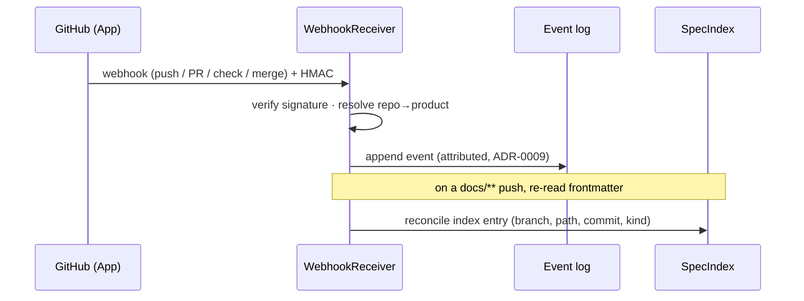
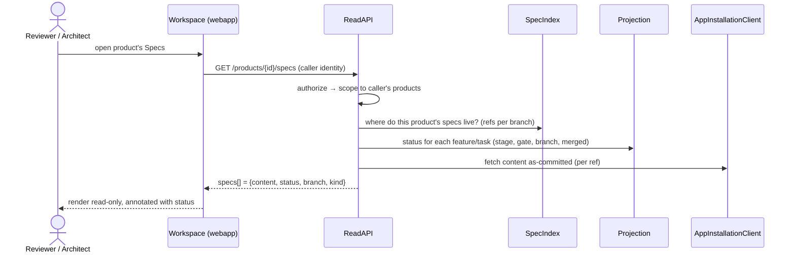

## Purpose

The backend that lets the **workspace** show specs/designs across many branches with live status, while
staying a pure projection (ADR-0015). It is **not a new service** — it is a cluster of components inside
the orchestrator/control plane that (a) ingest GitHub-origin facts as events ([ADR-0017](../decisions/0017-github-app-and-webhook-ingestion.md)),
(b) index where each spec/design lives via frontmatter ([ADR-0018](../decisions/0018-workspace-read-api-and-frontmatter-index.md)),
and (c) serve the **join of status + content** over a read API. No LLM inference lives here.

The on-screen artefact — *"this spec, on branch X, at the technical gate"* — is a **join of two
authoritative sources**: **content** from the repo (as-committed; ADR-0006/0008) and **status** from
maestro's event-log projection (ADR-0008). This component performs that join; it stores nothing
authoritative of its own.

## Responsibilities

**Owns:**
- Ingesting GitHub webhooks into the event log (signature-verified, `repo → product`-resolved).
- The **spec index**: `feature / task → {repo, branch, path, commit, kind}`, built from frontmatter.
- The **read API** the workspace consumes — status × content, per-product-isolated, read-only (S1).
- Minting/refreshing GitHub App installation tokens for the github adapter.

**Does not own:**
- Authoritative state — the **event log** is the source of truth (ADR-0008); this projects + serves it.
- The merge decision itself — that stays in the workspace (ADR-0016); the agent executes the merge. S1
  is read-only; the **write paths (S2/S3 + M1 dispatch) are pinned in
  [`contracts/workspace-write-api.md`](../contracts/workspace-write-api.md)** and ride the same
  `ReadAPI` HTTP surface (one binding, two contracts).
- LLM reasoning — none here (the crew, via the `ModelClient`).
- Spec *content* — the repo holds it; this renders it one-way.

## Internal structure

| Component | Responsibility |
|-----------|----------------|
| `AppInstallationClient` | Implements the engine spine's `GitHubClient` protocol using **App installation tokens** (App JWT → installation token, ~1h, auto-refreshed). Drop-in for the spine's HTTP-PAT client — the merge boundary is unchanged (ADR-0017). |
| `WebhookReceiver` | Verifies the HMAC signature against the App webhook secret, resolves `repo → product` (register), and **appends an event** per GitHub-origin fact (`push`, `pull_request`, `check_*`, merge). Rejects + logs unsigned / misrouted deliveries. Never mutates state directly (ADR-0008). |
| `SpecIndex` | Maps `feature / task → {repo, branch, path, commit, kind}` from **frontmatter** (ADR-0018). Seeded by crew events (which carry the ref), refreshed by the `push` reconciler on changed `docs/**`. Validates the `maestro:` frontmatter; flags malformed/missing. |
| `ReadAPI` | The orchestrator's first HTTP surface. Joins `SpecIndex` (where) + the **projection** (status) + `AppInstallationClient` (content) and returns rendered-ready specs scoped to the caller's products. Read-only in S1. |
| projection (existing) | The engine spine's event-log projection — delivery-task `stage`, gates, branch, merged. Reused unchanged. |

## Key flows

### Keep status fresh — a GitHub fact becomes an event

### Serve the Specs view — join status + content

## Error handling and failure modes

| Failure | Behaviour |
|---------|-----------|
| Webhook signature invalid | Reject (401), log a `webhook.rejected` event; no state change (ADR-0017) |
| Webhook for an unknown repo | Reject, log; `repo → product` must resolve (ADR-0010/0011) |
| `docs/**` file missing `maestro:` frontmatter | Index flags it; the read API surfaces it as `unindexed`, never guesses its mapping |
| Installation-token mint fails | `degraded` dependency; retry with backoff (`standards/reliability.yaml`) before surfacing |
| Repo content fetch fails for one ref | That spec renders as `unavailable`; the rest of the list still serves (no all-or-nothing) |
| Caller not a product participant | Excluded from results server-side; never a client check (ADR-0010/0011) |

## Open questions

- ~~**HTTP framework / API shape**~~ — the endpoint/JSON contract is now pinned in
  [`contracts/workspace-read-api.md`](../contracts/workspace-read-api.md). Framework stays an
  implementation detail (likely FastAPI; Python, `CODEBASE.md`).
- **Caller auth handshake** — Cloudflare Access + register vs. full `component-auth` OIDC ([ADR-0018](../decisions/0018-workspace-read-api-and-frontmatter-index.md) open question); settle in the webapp-auth slice.
- **Content caching** — commit-keyed cache to stay within rate limits; safe because the webhook keeps it fresh.
- **Receiver → projector coupling** — synchronous append to start; a queue when bursts demand it
  (ADR-0017), matching ADR-0008's SQLite→Postgres staging.
- **`check_*` → DoD mapping** — how CI check events feed the DoD gates (ADR-0006); addressed at M2/M3.
