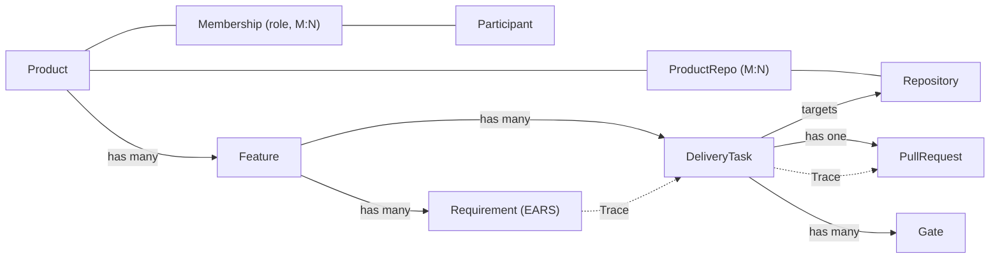

## Purpose

The core entities maestro reasons about, per [ADR-0005](decisions/0005-product-domain-model.md). This is a conceptual model — *where* state lives (a maestro-owned store, GitHub Issues/Projects + PR state, or a hybrid) is an open PRD-0001 decision and is deliberately not fixed here.

## Entities

| Entity | Description | Key fields |
|--------|-------------|-----------|
| **Product** | The unit of work. Holds the charter, one `product_type`, and visibility. | `id`, `name`, `product_type` (commercial \| technical), `visibility` (private \| public), `deploy_target` |
| **Repository** | A GitHub repo. Linked to products many-to-many. | `id`, `full_name`, `default_branch` |
| **Participant** | A human. Linked to products via a role. | `id`, `handle`, `name` |
| **ProductRepo** | Join: which repos a product owns (a repo may serve >1 product). | `product_id`, `repo_id` |
| **Membership** | Join: a participant's role in a product. | `product_id`, `participant_id`, `role` (architect \| functional_reviewer \| stakeholder \| …) |
| **Feature** | One functional spec + technical design. May produce changes across several repos. | `id`, `product_id`, `spec`, `design`, `state` |
| **Requirement** | One acceptance criterion (EARS) within a Feature's functional spec. | `id`, `feature_id`, `text` |
| **DeliveryTask** | One unit of implementation work; **targets** a repo (owned by the Feature, not the repo). | `id`, `feature_id`, `target_repo_id`, `stage`, `status`, `branch`, `pr_url` |
| **PullRequest** | The GitHub PR. Mirrors GitHub state; maestro never owns the merge. | `task_id`, `repo_id`, `pr_number`, `state`, `merged` |
| **Gate** | A pending or resolved human decision. | `id`, `task_id`, `type` (functional \| technical), `reviewer_role`, `assignee`, `status`, `feedback`, `resolved_by`, `resolved_at` |
| **Trace** | First-class link: requirement → task → PR/commit. | `requirement_id`, `task_id`, `pr_id` |

## Relationships

## State — DeliveryTask.stage

| Stage | Meaning | Advances on |
|-------|---------|-------------|
| `intake` | Created from Slack intent | functional spec produced |
| `functional_gate` | Spec awaiting functional review | reviewer approves |
| `design` | Producing technical design + tasks | design produced |
| `technical_gate` | Design awaiting architect review | architect approves |
| `build` | Implementing on a `maestro/*` branch | DoD gates green, PR opened |
| `merge_gate` | PR awaiting technical review of the diff | architect merges |
| `done` | Merge observed | terminal |
| `blocked` | Request-changes or rejection at any gate | returns to the relevant stage |

`status` (e.g. `active`, `blocked`, `cancelled`, `done`) is orthogonal to `stage`.

## Known limitations

- v1 realises one `DeliveryTask → one target repo`; a Feature producing coordinated PRs across multiple repos is modelled but built later (ADR-0005).
- Gate assignee resolution depends on `config/reviewers.yaml` + Membership at gate-creation time; if config or roster changes mid-task, in-flight gates keep their already-resolved assignee.
- If maestro syncs to GitHub, prefer issue-fields/sub-issues (which travel with the issue) over GitHub Project custom fields (which do not) — the maestro store is authoritative.
