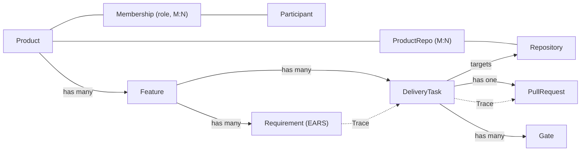

## Purpose

The core entities maestro reasons about, per [ADR-0005](decisions/0005-product-domain-model.md). This is a conceptual model — *where* state lives (a maestro-owned store, GitHub Issues/Projects + PR state, or a hybrid) is an open PRD-0001 decision and is deliberately not fixed here.

## Entities

| Entity | Description | Key fields |
|--------|-------------|-----------|
| **Product** | The unit of work. Holds the charter, one `product_type`, and visibility. | `id`, `name`, `product_type` (commercial \| technical), `visibility` (private \| public), `deploy_target`, `functional_channel` (surface + bot ref + group; ADR-0011) |
| **Repository** | A GitHub repo. Linked to products many-to-many. | `id`, `full_name`, `default_branch` |
| **Participant** | A human. Linked to products via a role. | `id`, `handle`, `name`, `slack_user_id`, `telegram_user_id` (per-surface identity for authz + attribution; ADR-0011) |
| **ProductRepo** | Join: which repos a product owns (a repo may serve >1 product). | `product_id`, `repo_id` |
| **Membership** | Join: a participant's role in a product. | `product_id`, `participant_id`, `role` (architect \| functional_reviewer \| stakeholder \| …) |
| **Feature** | One functional spec + technical design. May produce changes across several repos. | `id`, `product_id`, `spec`, `design`, `state` |
| **Requirement** | One acceptance criterion (EARS) within a Feature's functional spec. | `id`, `feature_id`, `text` |
| **DeliveryTask** | One unit of implementation work; **targets** a repo (owned by the Feature, not the repo). | `id`, `feature_id`, `target_repo_id`, `stage`, `status`, `branch`, `pr_url` |
| **PullRequest** | The GitHub PR. Mirrors GitHub state; the merge *decision* stays human, and maestro executes the merge against the recorded approval (ADR-0016). | `task_id`, `repo_id`, `pr_number`, `state`, `merged` |
| **Gate** | A pending or resolved human decision, delivered to a role's group surface (ADR-0011). | `id`, `task_id`, `type` (functional \| technical), `reviewer_role`, `surface` (slack \| telegram), `destination` (the role's group), `status`, `feedback`, `resolved_by` (the deciding participant), `resolved_at` |
| **Trace** | First-class link: requirement → task → PR/commit. | `requirement_id`, `task_id`, `pr_id` |
| **Event** | An append-only record of a state change or agent/human action — the operational **source of truth**; current state is a projection of these (ADR-0008/0009). | `id`, `run_id`, `seq`, `timestamp`, `actor`, `type`, `target`, `payload`, `prev_hash` |
| **LLMCall** | One `ModelClient` call — the LLM-call audit record (OTel GenAI; ADR-0009). | `id`, `run_id`, `agent`, `model`, `input_tokens`, `output_tokens`, `cache_read`, `cache_write`, `cost`, `latency_ms` |
| **Artifact** | A stored work product (spec/design export, diff snapshot, test report, SBOM). Bytes live in the `ArtifactStore`; the event log holds the reference (ADR-0012). | `id`, `product_id`, `task_id?`, `kind`, `storage_uri`, `sha256`, `created_at` |

## Relationships

## State — DeliveryTask.stage

| Stage | Meaning | Advances on |
|-------|---------|-------------|
| `intake` | Created from Slack intent | functional spec produced |
| `functional_gate` | Spec awaiting functional review | reviewer approves |
| `design` | Producing technical design + tasks | design produced |
| `technical_gate` | Design awaiting architect review | architect approves |
| `build` | Implementing on a `maestro/*` branch | DoD gates green, PR opened |
| `merge_gate` | PR awaiting technical review of the diff | architect approves; maestro merges (ADR-0016) |
| `done` | Merge observed | terminal |
| `blocked` | Request-changes or rejection at any gate | returns to the relevant stage |

`status` (e.g. `active`, `blocked`, `cancelled`, `done`) is orthogonal to `stage`.

## Persistence (where each entity lives)

Per [ADR-0008](decisions/0008-system-of-record-and-persistence.md) and [ADR-0009](decisions/0009-audit-logging-and-observability.md):

| Group | Home | Authority |
|-------|------|-----------|
| Product, Repository, Participant, ProductRepo, Membership | **git-tracked config** (`config/products.yaml`), loaded into the store read-only at boot | the register; changing it is a reviewed PR |
| Feature, Requirement, DeliveryTask, Gate, Trace | **maestro-owned, event-sourced store** — current state is a projection of the `Event` log | maestro |
| PullRequest, branches, commits, CI checks | **GitHub**, mirrored into the store read-only via webhooks | GitHub |
| Event, LLMCall | append-only **audit tier** (immutable; WORM + hash-chained) | maestro |
| Artifact (bytes) | **S3-compatible object store** — MinIO on ds1 by default, AWS S3 per-product opt-in (ADR-0012); per-product bucket/prefix | the store holds bytes; the event log holds the reference |

A single `run_id` (correlation ID) threads `Event`, `LLMCall`, and operational logs for a delivery task, so any run is reconstructible end to end.

## Known limitations

- v1 realises one `DeliveryTask → one target repo`; a Feature producing coordinated PRs across multiple repos is modelled but built later (ADR-0005).
- Gate routing resolves `(product, gate) → role → surface → destination group` from `config/reviewers.yaml` + the register at gate-creation time; any role-holder in that group may decide, quorum 1 (ADR-0011). If config or roster changes mid-task, in-flight gates keep their already-resolved surface + destination.
- If maestro syncs to GitHub, prefer issue-fields/sub-issues (which travel with the issue) over GitHub Project custom fields (which do not) — the maestro store is authoritative.
