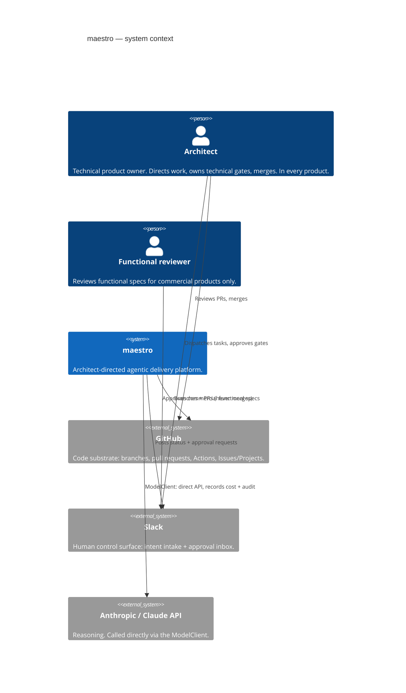
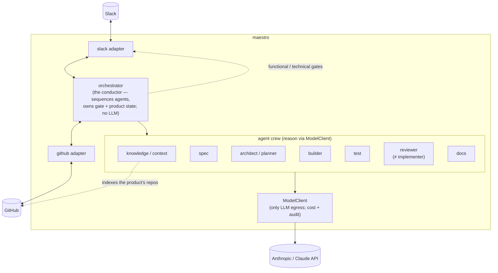

## Purpose

maestro coordinates a crew of Claude-powered agents to take a delivery task from intent to a merged pull request, with a human architect approving at gates, across a product's repositories. This document is the C4 system context (L1) and container view (L2), plus the agent crew. Diagrams are Mermaid blocks. Containers below the orchestrator are *planned* — this is a founding scaffold.

## System context (C4 L1)

## Container view (C4 L2)

## Layers

| Layer | Container(s) | LLM logic? | Role |
|-------|--------------|-----------|------|
| **Presentation** | slack adapter, github adapter | No | Human surface (Slack) and code substrate (GitHub) |
| **Orchestration** | orchestrator (conductor) | No | Sequences agents, owns delivery-task / gate / product state, resolves reviewer routing |
| **Egress** | ModelClient | No (transport) | The only path to Claude; records cost + audit per call |
| **Agentic** | the crew | Yes | All reasoning — via the ModelClient |

The orchestrator performs **no LLM inference** — it conducts. The ModelClient performs no reasoning — it is transport + audit. Intelligence lives in the crew.

## The agent crew

Bounded roles, with the boundaries that make a multi-agent crew better than one generalist (a reviewer that grades its own work is no check at all):

| Agent | Role | Boundary |
|-------|------|----------|
| **knowledge / context** | Maintains a persistent index over the product's repos + docs + history; other agents query it instead of re-reading. | Read-only over code; does not implement. |
| **spec** | Turns intent into a functional spec with EARS acceptance criteria; runs the clarify pass. | Produces the *what*, not the *how*. |
| **architect / planner** | Turns the approved spec into a technical design + ordered tasks (+ ADR on a real trade-off). | Produces the *how*; proposes, does not approve. |
| **builder** | Implements tasks on a `maestro/*` branch; opens the PR. | Never merges; never pushes to a default branch. |
| **test** | Generates and runs tests from acceptance criteria; reports results. | Does not refactor production code. |
| **reviewer** | Critiques the diff against `standards/`; posts triaged, severity-tagged PR comments. | **May not author the feature it reviews.** |
| **docs** | Updates docs to track the as-merged state. | Runs after code lands. |

## The delivery loop (happy path)

1. Architect dispatches a delivery task in Slack against a product + target repo. → orchestrator creates the task.
2. **spec** drafts a functional spec (EARS criteria); clarify pass runs. → orchestrator posts the **functional gate** (functional reviewer for commercial, architect for technical).
3. On approval, **architect/planner** produces a technical design + tasks. → orchestrator posts the **technical (design) gate** to the architect.
4. On approval, **builder** (with **test**) implements on a `maestro/*` branch; the **Definition of Done** gates run. **reviewer** posts a triaged review. **docs** updates docs.
5. When all DoD gates are green, orchestrator posts the **PR (annotated per requirement) to the technical (merge) gate**; the architect **merges manually** in GitHub.
6. orchestrator observes the merge event and marks the task done.

## Known limitations

- Single target repo per delivery task in v1; cross-repo features are modelled (ADR-0005) but realised later.
- No bespoke UI — Slack and GitHub's own surfaces only.
- Persistence of delivery-task / gate / product state is an open PRD-0001 decision; the diagram shows the orchestrator owning state without committing to where it lives.
- Whether the crew is built on the Claude Agent SDK (subagents, hooks, MCP) is an open engineering decision; the ModelClient boundary holds either way.
