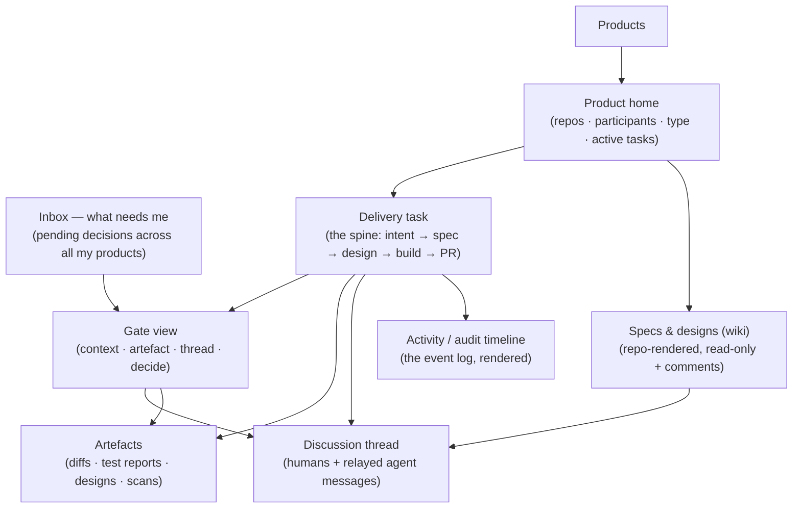

## Purpose

[ADR-0015](decisions/0015-reviewer-surfaces-repo-wiki-and-chat-webapp.md) adopted a maestro-owned
webapp scoped to **one role** (the functional reviewer) and **one spec type** (functional), with the
architect staying on Slack + GitHub. This document designs the next step the architect has chosen:
the webapp becomes maestro's **single common workspace** — every role, both spec types (functional
*and* technical), all interactions, artefacts, and the decision inbox, in one place.

This is a **concept + UX design**, not an ADR. It frames the surfaces, the flows, and the decisions
the move forces; the decisions are ratified in their own ADRs (see [Decisions this forces](#decisions-this-forces))
and sequenced into [`roadmap.md`](../product/roadmap.md).

## What changes from ADR-0015

| | ADR-0015 (today) | This concept |
|---|---|---|
| **Audience** | functional reviewers only | all participants — architect included |
| **Spec types** | functional only | functional **and** technical (design) |
| **Architect's surfaces** | Slack (control) + GitHub (docs + merge) | the **workspace** is primary; Slack/Telegram demote to **notification** channels |
| **The merge** | architect merges manually in GitHub | architect **approves in the workspace**; the agent then executes the GitHub merge (see [ADR-to-be: merge-after-approval](#decisions-this-forces)) |
| **Role in the system** | a surface / projection | **unchanged — still a surface, never the system of record** |

## The one invariant that does not change

The workspace is a **projection**, never the source of truth. The product repo holds the
specs/designs (ADR-0006/0008/0010); maestro's **event log** holds every decision, comment, and gate
transition (ADR-0008); the **ArtifactStore** holds diffs/reports (ADR-0012). The workspace **renders**
those and **emits events** back through the orchestrator — it stores no authoritative state of its own.
Widening the audience does not widen what the surface owns. This is the rule that kept us off
OpenProject/XWiki (ADR-0015) and it holds here by construction.

## Who uses it, and what they do

| Persona | Scope | In the workspace they… |
|---|---|---|
| **Architect** | every product | dispatch intent · read & discuss functional specs + technical designs · decide design + merge gates · approve-and-merge · browse artefacts · work the cross-product inbox |
| **Functional reviewer** | their product(s) only | read the functional spec · discuss it · decide the functional gate |
| **Other participants** (stakeholders, domain reviewers) | their product(s) only | read · discuss · (decide only gates their role owns) |

Per-product isolation (ADR-0010/0011) is unchanged: a participant sees only the products they're in.
The architect is in every product, so the architect sees everything — by membership, not by exception.

## Information architecture



The surfaces, and what each is:

| Surface | What it is | Authoritative source rendered |
|---|---|---|
| **Inbox** | one queue of pending decisions across every product the participant is in, each item carrying its context (the Agent-Inbox idea from ADR-0013) | event log (open gates) |
| **Products / product home** | the product switcher and a per-product overview — repos, participants, type, active delivery tasks, gate status | register + event log |
| **Delivery task** | the spine — one unit of intent moving through its stages and gates, with its threads and artefacts attached | event log |
| **Specs & designs (wiki)** | repo-rendered, one-way, read-only-with-comments view of **both** functional specs and technical designs | product repo (as-committed) |
| **Gate view** | the decision surface — gate context, the rendered artefact (spec / design / diff), the thread, and the role-scoped controls (approve / request-changes / reject; approve-&-merge on the merge gate) | event log + repo + ArtifactStore |
| **Artefacts** | browse the diffs, test reports, designs, SBOM/scan outputs tied to a task or gate | ArtifactStore (ADR-0012) |
| **Discussion thread** | per-task / per-gate, cross-role; human comments plus agent messages relayed by the orchestrator | event log |
| **Activity / audit timeline** | the event log rendered as "who decided what, when, why," per product | event log (ADR-0009) |

## Key flows

The flows the workspace adds or moves off Slack. The two that are genuinely new are **intent dispatch**
in-workspace and the **merge gate**.

### Decide a gate (functional or design) — generalises US-0030

```mermaid
sequenceDiagram
  actor R as Reviewer / Architect
  participant W as Workspace
  participant O as Orchestrator
  participant L as Event log

  O->>W: gate opened (context + repo-rendered artefact)
  R->>W: read · comment in thread
  W->>O: comment event (webhook/REST)
  O->>L: append (authorized by role, attributed)
  R->>W: decide (approve / request-changes / reject)
  W->>O: decision (role-checked client + server)
  O->>L: append decision; resolve gate
  O->>W: gate state updated
```

### The merge gate — approve in the workspace, agent executes the merge

```mermaid
sequenceDiagram
  actor A as Architect
  participant W as Workspace
  participant O as Orchestrator
  participant L as Event log
  participant G as GitHub

  Note over W: PR context + diff + green DoD shown in-workspace
  A->>W: Approve & merge
  W->>O: merge-approval (role = architect, for this product)
  O->>L: append human-approval event (who/what/when)
  O->>G: merge PR — authorized only by that recorded event
  G-->>O: merge observed
  O->>L: append merge event; task done
  O->>W: task marked done
```

**What is preserved:** the *decision* is the human's, recorded and attributed before any merge.
**What changes:** the mechanical merge moves from a human click in GitHub to an agent action gated by
that recorded approval. This trades a **platform-enforced** boundary (the token cannot merge) for a
**maestro-enforced** one (the agent merges only against a role-authorized approval event). That is the
[merge-after-approval decision](#decisions-this-forces) — its own ADR, with the security analysis.

**Authority model (chosen, 2026-05-26):** the **recorded approval event is the sole authority** for
the merge — the agent's token gets merge rights and maestro gates the merge purely on the role-authorized
approval event in its log; no GitHub-side review or branch-protection backstop is required. Note this is
*authorization*, not *quality*: the orchestrator only ever opens the merge gate once DoD is green
(see [`overview.md`](overview.md) step 5), so the simplest authority model still never merges un-vetted
work — the quality gate lives in maestro's flow, not in GitHub branch protection.

## How it stays a surface (architecture fit)

Nothing below the surface layer changes shape; the webapp slots in beside the Slack/Telegram adapters
and talks to the orchestrator over the **same webhook/REST contract** ADR-0015 already defined:

- **Every action → an event.** Comment, decision, dispatch, merge-approval all flow
  webapp → orchestrator → authorize by role (ADR-0011) → append to the event log (ADR-0008) →
  render the result back. One writer of truth.
- **Specs/designs render one-way from the repo** (ADR-0006/0008/0010) — read-only-with-comments; the
  repo stays the source of truth. Editing happens via the crew + PRs, never in the workspace.
- **Artefacts** come from the ArtifactStore (ADR-0012), presigned/proxied — not re-stored.
- **Identity / RBAC / attribution** via `component-auth`; **reasoning** (LLM chat replies, a later
  story) via the `sovereign-llm-gateway`; **exposure** only over the Cloudflare Tunnel + Access
  (ADR-0012) — never an open inbound port.
- **Slack / Telegram** stay wired, demoted to **notification + deep-link** surfaces ("a gate needs you
  → open it in the workspace"). A reviewer *can* still act from a notification surface where ADR-0011
  allows; the workspace is the rich surface, not the only one.

## Decisions this forces

These are ratified in ADRs, not here. This concept names them so the roadmap can sequence them.

1. **Webapp becomes maestro's primary, unified human surface** (all roles; functional + technical
   specs). *Extends ADR-0015* (was: functional reviewers only) and *revises `vision.md`* ("architects
   stay on Slack + GitHub"). Slack/Telegram demote to notification channels. → **new ADR**.

2. **Merge-after-workspace-approval.** The human approves the merge gate in the workspace; the agent
   executes the GitHub merge against the recorded approval event. *Amends ADR-0004* ("humans merge")
   and the vision's platform-enforced no-merge guarantee. This is the load-bearing one — it weakens an
   externally-enforced invariant into an internally-enforced one. **Direction chosen (2026-05-26): the
   recorded approval event is the sole merge authority** (agent gets merge rights; no GitHub backstop) —
   see [the merge gate flow](#the-merge-gate--approve-in-the-workspace-agent-executes-the-merge). →
   **ratified in [ADR-0016](decisions/0016-merge-after-workspace-approval.md)** (single-layer — no GitHub
   backstop; the event-gated github adapter + WORM log is the boundary; first-run verification inverts
   from "cannot merge" to "refuses to merge without a valid approval event").

3. **Re-baseline the roadmap** so the workspace is the human surface from the early milestones, not M4.
   The current "technical product first → Slack-only MVP → defer the webapp" scoping is inverted: the
   workspace ships incrementally from the start. → **roadmap rewrite** (not an ADR).

## Stepwise rollout (implement in steps)

Each step delivers something usable and depends only on what precedes it — the same discipline as the
adoption ladder in [`roadmap.md`](../product/roadmap.md). Steps map onto the re-baselined milestones in
the roadmap-integration phase; this is the surface-track shape.

| Step | Capability | Builds on | Notes |
|---|---|---|---|
| **S1 — Read** | the wiki: repo-rendered functional **and** technical specs, read-only, behind `component-auth` + Cloudflare Access | current `web/` scaffold | the single-source-of-truth-preserving core; no orchestrator write path yet |
| **S2 — Discuss** | per-task / per-gate discussion threads → events | S1 + the webhook/REST contract + event log (ADR-0008) | first write path; humans + relayed agent messages |
| **S3 — Decide** | gate view with approve / request-changes / reject for functional **and** design gates → events → orchestrator | S2 + `GateManager` (ADR-0011) | generalises US-0030 to both spec types and the architect |
| **S4 — Artefacts** | artefacts browser (diffs, test reports, designs, scans) | S3 + ArtifactStore (ADR-0012) | pulls ADR-0012 forward from M4 |
| **S5 — Dispatch + merge** | dispatch intent in-workspace; the merge gate with approve-&-agent-merge | S3 + the merge-after-approval ADR | the two new flows; needs the merge-boundary decision settled first |
| **S6 — Inbox + activity** | the cross-product decision inbox and the audit/activity timeline; formally demote Slack/Telegram to notifications | S3–S5 | the architect's primary view; the "common space" is whole |

> **v1 first cut** (architect's call, 2026-05-26): **S1–S2 + S4** content — functional **and** technical
> specs, cross-role discussion threads, and the artefacts browser. The **inbox (S6)** is part of the
> concept but deferred to a later step.

## Open questions

- **Wiki renderer** — in-app Next.js MDX vs. a sibling static site (MkDocs Material / Docusaurus /
  Backstage TechDocs). A build-time pick, carried over from ADR-0015; now must cover technical designs
  too (diagrams, ADR cross-links).
- **Merge boundary mechanics** — see decision 2; settle before S5.
- **External-reviewer auth** inside `component-auth` (OIDC / magic link / Cloudflare Access) — carried
  over from ADR-0015.
- **Intent dispatch UX** — does dispatching in-workspace replace the Slack dispatch entirely, or run
  alongside it during transition?
- **How much of `chatbot`** is reused for the thread UI vs. maestro-specific.
- **Inbox semantics with quorum-1** (ADR-0011) — when any role-holder can decide, an item resolved by
  one teammate must clear from the others' inboxes promptly.
