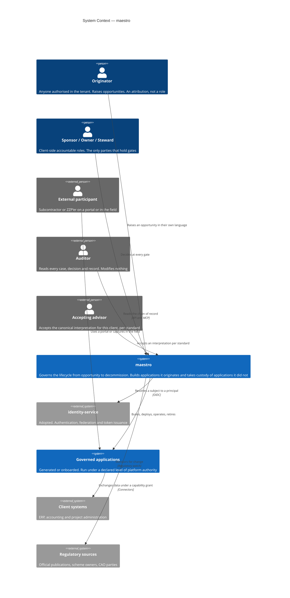
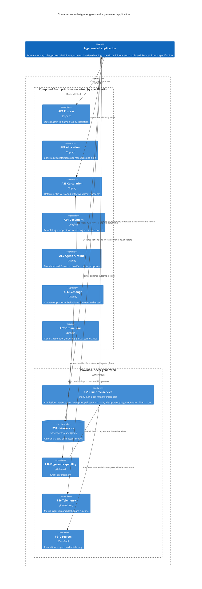
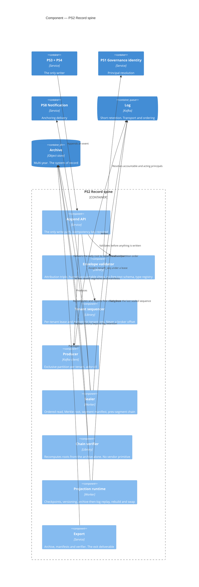
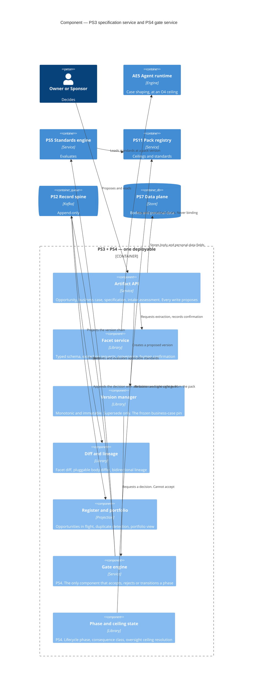
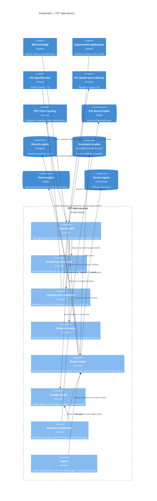
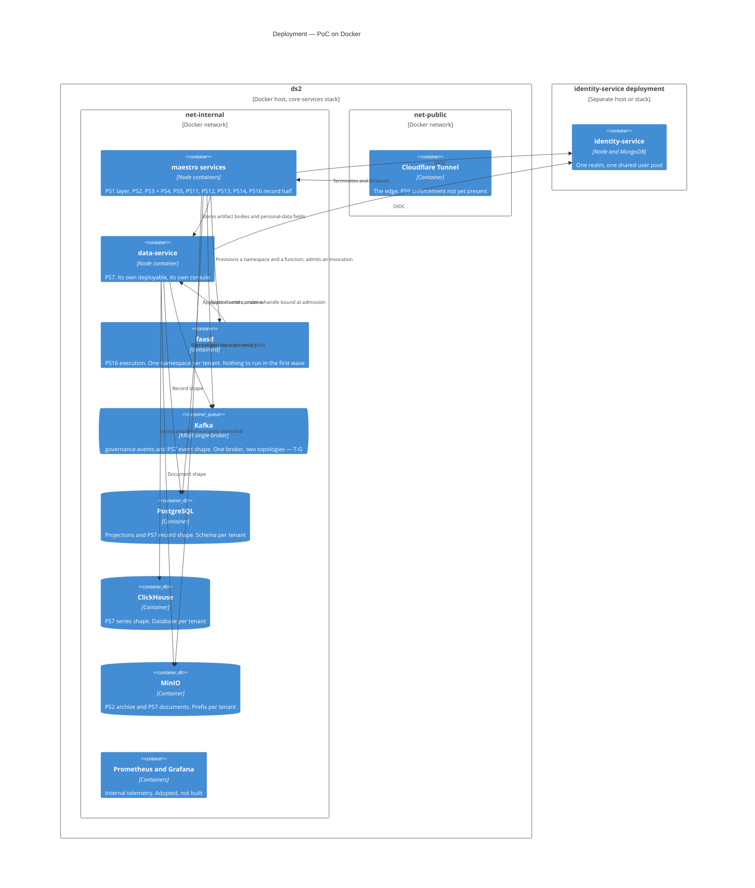
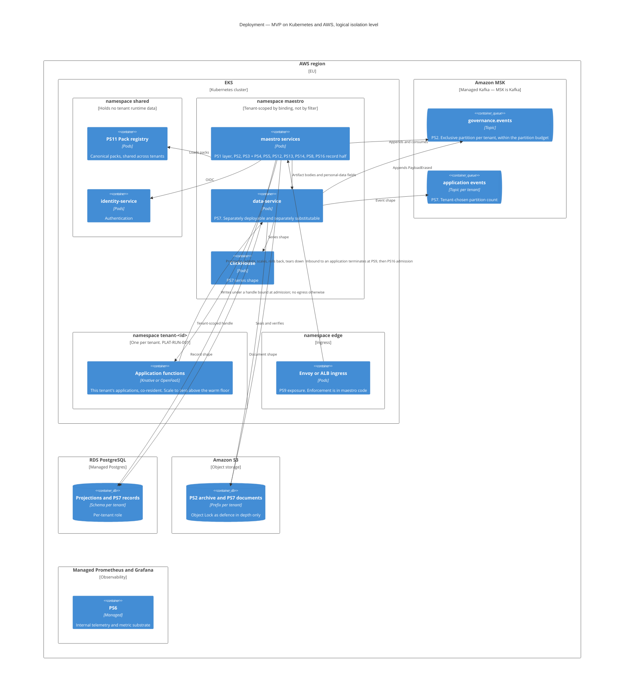
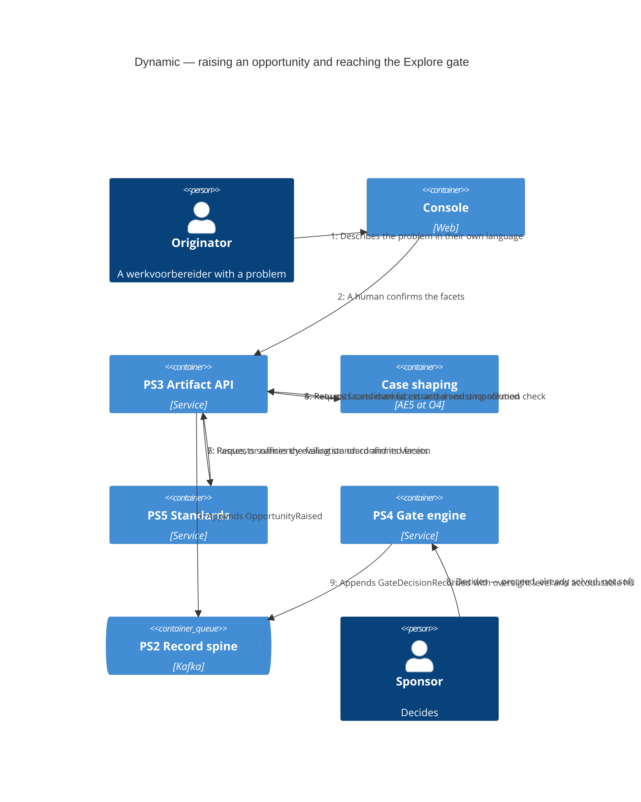

# maestro — Governed Application Platform — C4 Diagrams

**Status:** Draft v0.4 — for refinement
**Companions:** `conceptual-design.md` (v1.0), `technical-design.md` (v1.0), and the service designs `ps1-identity-service.md`, `ps2-record-spine.md`, `ps3-specs-service.md`, `ps7-data-service.md`, `ps14-work-service.md`, `ps15-agent-service.md`, `ps16-runtime-service.md`. These diagrams are **derived**, never authoritative — where a diagram and a document disagree, the document is right and the diagram is stale.
**On this document's own governance:** `platform-standards.md` §5.4 and finding 12 record that this file is a second, ungoverned descriptive specification of a subject D39 already puts in PS3, with no `verified_at` and no PS12 to expire it — and v0.3 proved the point by citing three stale companion versions and mapping containers to PS1–PS13 while PS14 and PS15 existed. **v0.4 fixes the instance and not the mechanism**, which is V15's actual finding.
**Rendering note:** Mermaid's C4 support is marked experimental upstream. Layout varies between renderers; the semantics do not. If a diagram lays out badly in your viewer, the element and relationship lists are still the content.

---

## 1. How to read these

C4's four levels map onto this platform's own vocabulary, and the mapping is not quite the default one. It is worth stating, because two of the mappings are decisions rather than conventions.

| C4 level | Here | Note |
|---|---|---|
| **1 Context** | The platform, its people, and the systems it touches | §3 of the conceptual design supplies the actors, already separated into client-side roles, external parties, and platform functions |
| **2 Container** | PS1–PS16 and AE1–AE7 | §9's generation boundary decides membership: *provided, never generated* and *composed from primitives* are containers |
| **3 Component** | Inside one service | Drawn for PS2, PS3+PS4, and PS7 — the ones with enough internal structure to be worth it |
| **4 Code** | Not drawn | C4's own guidance, and it would be stale within a week |

**Two modelling decisions worth flagging.**

**A generated application is a software system, not a container.** It is emitted by the composition plane from a specification (P1) and runs *against* the platform's engines. Drawing it as a container inside the platform would put per-application code inside a boundary §9 spends its length keeping it out of.

**The eight planes are not containers and never appear as boxes.** §4's planes are a conceptual decomposition — the specification plane is PS3, but the delivery-and-operations plane is PS13 plus part of PS6 plus a CI pipeline, and the assurance plane is PS12 plus PS5. Forcing planes onto containers is what produced the T20 omission in the first place: a plane that looks like it has a box gets assumed to have a service.

---

## 2. Level 1 — System context

**What this diagram argues.** The people who *hold* something are on the left and outside; the platform holds machinery and no gates. The advisor and the auditor are external parties with their own liability — drawing them inside would be the governance-laundering failure §14.11 names.

---

## 3. Level 2 — Containers: platform services

```mermaid
C4Container
    title Container — platform services

    Person(governance, "Sponsor / Owner / Steward / Auditor", "Client-side roles")
    System_Ext(idp, "identity-service", "Adopted authentication")

    System_Boundary(platform, "maestro") {

        Container(ui, "Console", "Web", "Raise, shape and confirm, decide, register. The primary human surface")

        Container_Boundary(shared, "Shared across tenants — holds no tenant runtime data") {
            Container(ps11, "PS11 Pack registry", "Service", "Versioned effective-dated domain packs, materiality classification, oversight ceilings")
            Container(market, "Marketplace", "Service", "Published specification versions and metadata only. Phase 5")
        }

        Container_Boundary(pertenant, "Per tenant — logical by default, physical by choice") {
            Container(ps1, "PS1 Governance identity", "Service", "Principal registry, tenants and membership, agent principals, seat occupancy")
            Container(ps3, "PS3 + PS4 Specification and gates", "Service", "Chain of record, versioning, diff, lineage. Propose and accept")
            Container(ps5, "PS5 Standards engine", "Service", "Evaluates machine-evaluable assertions against a case or a specification")
            ContainerQueue(ps2log, "PS2 Record spine — log", "Kafka", "Append-only governance events. Exclusive partition per tenant")
            ContainerDb(ps2arc, "PS2 Record spine — archive", "Object store", "Sealed segments and Merkle chain. The system of record")
            Container(ps12, "PS12 Assurance and drift", "Service", "Triggers, re-evaluation, expiry, the conformance record")
            Container(ps13, "PS13 Artifact custody", "Service", "Artifact identity, signature, SBOM, rollback target")
            Container(ps14, "PS14 work-service", "Service", "Commitments and their closure. Authority checked at claim")
            Container(ps16, "PS16 runtime-service", "Service", "The instance: version, environment, envelope, authority, hosting party. Executes the ones we host")
            Container(ps8, "PS8 Notification", "Service", "Deadline-bearing delivery, tracked and recorded")
            Container(ps6, "PS6 Telemetry", "Prometheus and Grafana", "Ingestion, storage, query, dashboard runtime")
            ContainerDb(ps7, "PS7 data-service", "Service over four engines", "Record, document, event, series. Classification, schema evolution, history, lineage, erasure")
            Container(ps9, "PS9 Edge and capability", "Gateway", "Inbound exposure. Ceilings, limits and revocation")
            Container(ps10, "PS10 Secrets and policy", "OpenBao", "Credential custody and policy distribution")
        }
    }

    Rel(governance, ui, "Uses", "HTTPS")
    Rel(ui, ps3, "Every write proposes", "API")
    Rel(ps1, idp, "Resolves subject to principal", "OIDC")
    Rel(ps3, ps1, "Resolves and validates principals")
    Rel(ps3, ps2log, "Appends every write and every decision")
    Rel(ps3, ps7, "Stores personal-data-bearing payloads")
    Rel(ps2log, ps2arc, "Seals segments")
    Rel(ps2log, ps3, "Projects read models")
    Rel(ps3, ps5, "Requests evaluation")
    Rel(ps5, ps11, "Loads standards at a pack version")
    Rel(ps12, ps5, "Triggers re-evaluation on a date or a publication")
    Rel(ps12, ps8, "Escalates with a derived deadline")
    Rel(ps2arc, ps8, "Delivers the daily integrity root")
    Rel(ps13, ps2log, "Records deployment events")
    Rel(ps7, ps2log, "Records PayloadErased")
    Rel(ps12, ps14, "Raises a work item; PS14 chases it")
    Rel(ps16, ps2log, "Records instance lifecycle. Never an invocation")
    Rel(ps16, ps13, "Resolves the pinned artifact and the rollback target")
    Rel(ps16, ps3, "Requires an accepted decision before an instance exists")

    UpdateLayoutConfig($c4ShapeInRow="3", $c4BoundaryInRow="1")
```

**What this diagram argues.** The two boundaries are the answer to T-L and T29: everything inside *per tenant* is isolated logically or physically as the deployment chooses; everything inside *shared* qualifies only because it holds no tenant runtime data. PS2 appears as two containers on purpose — the log and the archive are different things with different retention, and T4 turns on the distinction.

Note how few arrows there are into PS2, and what each one carries. **Five containers write to it: PS3 and PS4 with versions and decisions, PS13 with deployment events, PS7 with `PayloadErased` and nothing else, and PS16 with instance lifecycle.** That is R11 and P13 drawn rather than asserted — and PS7's single edge is the point of PS2 §8, since erasure has to be recorded on the spine precisely because it is never performed on it. *(v0.1 of this document omitted the PS7 edge and claimed three writers; PS2 §9 always permitted it — see `ps7-data-service.md` §16.1.)*

**PS16's edge is labelled with what it does *not* carry, and that is the point of it** (T52). A runtime service is the estate's most likely source of PS2 volume leakage, because every invocation superficially looks like something worth recording. Four instance-lifecycle types reach the spine; invocations go to PS6 and their effects to PS7. **The `PS16 → PS3` edge is the other half**: an instance cannot exist without an accepted decision behind it, which is P13 reaching the runtime rather than stopping at the composition plane.

---

## 4. Level 2 — Containers: engines and a generated application

**What this diagram argues.** Three relationships carry most of §9. `AE5 → AE3` is the determinism boundary — the agent proposes, the calculation engine computes anything binding (P3, T14). `AE6 → PS9` is why capability enforcement is provided rather than composed (D41): if outbound calls could route around the gateway, P8's grants would be advisory.

**`PS16 → generated application` is new in v0.4 and it changes what this diagram is about.** Through v0.3 the generated application floated with no substrate — it composed engines and wrote to PS7 and nothing said where it *ran*, which is §4.5's omission drawn rather than argued. With PS16 in the frame the direction of the arrow is the finding: **the runtime calls the application, not the other way round.** Under T44 the application has no process of its own to be called into; it is admitted, and admission is where the tenant handle is bound, the workload principal is minted, and the idempotency key is checked. That is why PS16 sits in the provided boundary between PS9 and the application rather than beneath it.

PS10 is drawn here for the first time for the same reason: under a long-running container its credentials are injected once at boot, which is a deployment detail; under T44 they expire with the invocation, which is an edge.

`AE6 → PS7` is the third, added in v0.2, and it is the one that keeps T19 honest. **The exchange engine and the data service are separate containers precisely because a connector crosses a trust boundary and enforces a capability grant**, which is governance rather than data — and the edge between them carries two obligations, not one: the fact, and its `ingested_from` provenance (PS7 H13). Drawing them as one box is the collapse T33 exists to prevent, and it is what `event-integration-platform` is today.

---

## 5. Level 3 — Components: PS2 record spine

**What this diagram argues.** The validator sits before everything and calls PS1 — that is R1 and I3, the point where P12 stops being a sentence. The sealer, not the append path, touches the archive and computes the chain (R6), which is why append stays fast and retry-safe. And the projection runtime reads the archive *and* the log, which is R8: a projection that can only replay from the log is one retention window from being unrebuildable.

---

## 6. Level 3 — Components: PS3 specification service and PS4 gates

Drawn as one container because T26 ships them as one deployable with a hard internal boundary while T-D is open. The boundary is the point of the diagram.

**What this diagram argues.** There is exactly one arrow into PS2 from this container and it starts at the gate engine. Everything else proposes. That is P13 as a topology rather than a convention — and it is why the internal boundary can be trusted while the two live in one deployable.

---

## 7. Level 3 — Components: PS7 data service

*New in v0.2, from `ps7-data-service.md`. Drawn because the service's whole claim is that a fact and its obligations are stored together, and that claim is a component arrangement rather than a sentence.*

**What this diagram argues.** Three things, and each is a decision that would be invisible in prose.

**The classification validator sits before the router.** Nothing reaches an engine without a validated classification, which is what makes §2.4 of the technical design structural rather than aspirational — the same position, and the same argument, as PS2's envelope validator in §5.

**The shape router is the only component that knows an engine exists.** T19 and T22 both live there. If any other component named Postgres or Kafka, the contract would have leaked its substrate and the four engines would stop being independently replaceable — which is what §14.7's substitution ladder depends on.

**The erasure orchestrator touches every engine and the lineage graph, and appends to PS2.** That single component is the whole of T25's other half: the payload goes, the lineage node stays marked, and the spine records that it happened. Drawing it as a `DELETE` on one engine is how erasure quietly becomes partial.

---

## 8. Deployment — PoC on Docker

**The PoC runs a real FaaS with nothing on it, and that is deliberate** (§3.2 of the technical design). There is nothing to execute until the composition plane exists, so `faasd` here is empty — but the cheap PoC answer is a long-running container per application, and §2.2 of the PS16 design lists four Tier 1 invariants that are structural under one substrate and merely conventional under the other. **Fake the scale, never the shape**, applied to the third of the three things that rule was written for.

**Three things are real here even though they look optional at this scale** (§3.2 of the technical design): the archive as a store separate from Kafka, the explicit tenant-to-partition map, and the daily seal. Faking any of them fakes the shape rather than the scale.

**One broker carries both PS2 and PS7's event shape on the PoC, and that is T-G taken pragmatically rather than answered.** The two topologies stay distinct on it — exclusive partition per tenant for governance events, topic per tenant with a tenant-chosen partition count for application events (T34) — so the question left open is a cost and blast-radius one, and splitting the cluster later changes configuration rather than design. `data-service` is drawn as its own container because it is one (T32), and its `identity-service` edge is its own: it does not authenticate through maestro.

---

## 9. Deployment — MVP on Kubernetes and AWS

**The physical isolation level is this diagram with a dedicated MSK cluster, RDS instance, S3 bucket and namespace per tenant — and no change to any service.** That is what T28's binding rule buys: the code cannot tell which level it is running at, so the level is a deployment decision. `PS11` and the marketplace stay shared at both levels.

**`namespace tenant-<id>` is the one node here that is a Tier 1 standard rather than a deployment convenience** (`PLAT-RUN-001`, T45). A tenant's own applications share it; two tenants never do. **The `fn → dsk` edge is drawn as the only edge out of that node on purpose** — under T44 the namespace carries a network policy with no general egress, so the absence of every other arrow is the diagram's content rather than its omission. That is D41 enforced by topology, which §11's omissions list would otherwise have to explain away.

**At the physical level the tenant namespace becomes a node pool or a cluster** — the same third row as everywhere else, and unlike the data plane it costs nothing to move, because a function is a stateless OCI artifact and its state was never local (`PLAT-RUN-003`). **Compute is therefore the most reversible thing in this diagram and the data plane remains the least**, which is §14.7's ordering criterion re-derived from the substrate rather than assumed from the table.

**Every managed service here is a hosted build of an open component** (T21): MSK is Kafka, RDS is Postgres, S3 has an S3-API-compatible open equivalent, Managed Grafana is Grafana, and the FaaS layer is Knative or OpenFaaS on EKS rather than Lambda — which is the same rule at the point it is most tempting to break (§3.1).

---

## 10. Dynamic — an opportunity through the Explore gate

**What this diagram argues.** Steps 4 to 7 are the whole of S4: an agent proposes facets, a human confirms them, and only confirmed facets are evaluated. Nothing binding is model-inferred (P3), and the agent's O4 ceiling is safe precisely because its output cannot reach a gate unconfirmed. Note also that four of the sponsor's five outcomes end here and produce no specification at all (P11).

---

## 11. What these diagrams deliberately omit

Recorded so their absence reads as a decision rather than an oversight.

| Omitted | Why |
|---|---|
| **The eight planes as boxes** | §1 — a plane is a conceptual decomposition and does not map one-to-one onto services. Drawing them invites the T20 assumption that a plane has a service |
| **The composition plane** | Deferred to Phase 1; demo applications are hand-built. Drawing it would imply it exists |
| **Oversight levels and ceilings** | Properties of records and seats, not components. They appear on every decision, which is not a shape |
| **The onboarding ladder N0–N4** | A property of an application's relationship to the platform, not a structural element. §14.2's table is the right representation |
| **Per-archetype containers** | An archetype is a composition pattern; the twelve of them share seven engines, which is what §4.3's matrix shows better than a diagram would |
| **Code level** | C4's own guidance, and it would be stale within a week |
| **`exchange-service` internals** | AE6 appears as one container and no more. It is deferred in the technical design's engine order and has no design document — T-Q asks whether it needs one. Drawing components for a service nobody has designed would invent them |
| **PS15 `agent-service`** | It has a design and no container here yet. Its component-level content is the mediator's ordered checks, which is a *sequence* and belongs in a dynamic diagram rather than a container one — and PS15 §1.2 has not decided whether it is a repository or a deployable, which is exactly what a container diagram would be asserting |
| **PS16 component level** | The admission chain is six ordered steps and would draw as PS2's validator does, but the execution half is deferred by trigger (§6) and **T-W** asks whether PS16 is one service or two. Drawing components would settle T-W in a derived document, which is the inversion §1 exists to prevent |
| **An invocation as a relationship into PS2** | Its absence *is* T52, and it is the one omission in this table that is a standard rather than a scoping choice. Every other row says *not yet* or *not here*; this one says *never* |

---

## 12. Change log

| Version | Date | Change |
|---|---|---|
| 0.1 | 2026-08-03 | Initial set. Context, two container diagrams split by generation boundary, two component diagrams for PS2 and PS3 + PS4, two deployment diagrams for the Docker PoC and the Kubernetes plus AWS MVP, and one dynamic diagram for the Explore gate. Two modelling decisions recorded: a generated application is a software system rather than a container, and the eight planes are never drawn as boxes. §10 records deliberate omissions |
| 0.2 | 2026-08-04 | **PS7 component diagram added as §7**, from `ps7-data-service.md` — the classification validator drawn ahead of the shape router, and the shape router as the only component that knows an engine exists (T19, T22). Sections 7–11 renumbered to 8–12. **Two missing container edges corrected:** `PS7 → PS2` for `PayloadErased`, which §3's prose had claimed did not exist (PS2 §9 always permitted it), and `AE6 → PS7` carrying the fact plus its `ingested_from` provenance, which is the interface T33's split turns on. PS7 relabelled `data-service` in both container diagrams (T32). Both deployment diagrams extended with the series engine and with `data-service` as its own deployable authenticating directly to `identity-service`; the MVP diagram now shows PS2's and PS7's event topologies as two distinct shapes on one MSK cluster (T34), and the PoC note states what T-G still leaves open. `exchange-service` internals added to §11's deliberate omissions, pending T-Q |
| 0.4 | 2026-08-06 | **PS16 `runtime-service` drawn into both container diagrams and both deployment diagrams** (T43, T44). In §4 it changes what the diagram is about: through v0.3 the generated application floated with no substrate, composing engines and writing to PS7 with nothing saying where it *ran* — §4.5's omission drawn rather than argued. The **direction of the new arrow is the finding**: the runtime calls the application, because under T44 the application has no process of its own to be called into, and admission is where the tenant handle binds, the workload principal is minted and the idempotency key is checked. PS10 appears in §4 for the first time for the same reason — invocation-scoped credentials are an edge where boot-time injection was a deployment detail. In §3, `PS16 → PS2` is labelled with **what it does not carry** (T52), and `PS16 → PS3` puts P13 in the runtime rather than stopping it at the composition plane; the writers-to-PS2 count corrected from four to five. **The MVP diagram gains `namespace tenant-<id>`**, which is a Tier 1 standard rather than a deployment convenience (`PLAT-RUN-001`) and whose single outbound edge is the content — no general egress is D41 enforced by topology. The PoC gains an empty `faasd`, deliberately: there is nothing to run in the first wave and the cheap answer, a long-running container per application, is the one §2.2 of the PS16 design rules out. **PS14 added to the platform-services container diagram** and to both deployment node lists, having been missing since it existed, with the `PS12 → PS14` raise-and-chase edge drawn (T36). §11 gains three omissions, one of which — an invocation as an edge into PS2 — is the only row in that table that says *never* rather than *not yet*. Companion versions corrected and §5.4's finding about this document acknowledged in the header: **v0.4 fixes the instance and not the mechanism**, which is V15's point |
| 0.3 | 2026-08-05 | **Renamed to `maestro`** (conceptual D44) — the document title, the §2 context-diagram title, and the three `System`/`System_Boundary` labels that carried the retired `"The Platform"` placeholder. Cross-references updated for the dropped `adel-` filename prefix, and the stale `ps1-identity.md` and `ps3-specification-service.md` companion references corrected. **No element, relationship, boundary, or diagram was added, removed, or redrawn** — which is the point worth recording, since a naming change that moved a boundary in a derived document would mean the boundary was never in the source |
