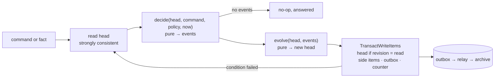

# ADR-0019 · work-service's table: a partition per item, the open set as an index, clocks by a sweep

**Status:** accepted · 2026-09-25 · applies [ADR-0018](0018-dynamodb-is-the-mvp-database.md) to [work-service](../components/work-service.md); follows [ADR-0009](0009-one-severity-scale.md) and [ADR-0012](0012-the-application-owns-detection-maestro-owns-response.md)

## Context

[ADR-0018](0018-dynamodb-is-the-mvp-database.md) fixed the shape every component's store shares: one table keyed `pk`/`sk`, a workspace's items under `ws#<workspace>#`, a handle that refuses any other prefix, the outbox as one `TransactWriteItems` with the workspace's counter as its condition, a sparse `pending` index for the relay, uniqueness as a conditional put, expiry as TTL on `expires_at`. It also said access patterns are designed, not discovered. specs-service took that shape with two general indexes (`gsi1`, `gsi2`) and one sparse one.

work-service is the first component written on DynamoDB from its first line, and its reads are not specs-service's. Seven things have to be answerable from keys:

1. **One item and its transitions** — with a state machine whose transitions must not race (first claim wins; `outcome` is write-once).
2. **The frontier** — what is owed now, by whom, due when, with the next human touchpoint.
3. **The board** — the same set over the state machine's columns, by milestone and by application.
4. **Today** — a person's slice of the frontier.
5. **Clocks** — `respond_by`, `resolve_by`, the chase ladder, lease expiry, `review_by`: something must notice when a time passes.
6. **Evidence** — an incoming fact (a merge, a deploy, an alarm back to OK, a re-scan) must find the open items waiting on it without a scan.
7. **Intake** — a signal delivered twice, or a storm of one fingerprint, must raise one item.

Plus one number the M2 gate asks for in one call: the `escalated_out` rate per application.

## Decision

### 1. The table is the shared shape, unchanged

Same attributes as specs-service's: `pk`/`sk`; `gsi1` (`gsi1pk`/`gsi1sk`) and `gsi2` (`gsi2pk`/`gsi2sk`), both projecting the whole item; the sparse `pending` (`pending_pk`/`pending_sk`); TTL on `expires_at`; on demand, point-in-time recovery, `prevent_destroy`. What differs between components is the key layout, not the table — one Terraform resource shape, one boot check, one code-vs-grant test across the estate. Each index below is given a role; nothing is indexed that no query reads.

### 2. The key layout

A work item is a **partition**, not a row in a shared partition: its head and the few things that hang off it live together, and one `Query` reads the item with its edges.

| Item | `pk` | `sk` | Index keys |
|---|---|---|---|
| **work item head** | `ws#W#item#<id>` | `head` | `gsi1`: open → `ws#W#open` / `<next_at>#<id>`; closed → `ws#W#closed#<yyyy-mm>` / `<closed_at>#<id>` · `gsi2` (about an application): `ws#W#app#<application>` / `<opened_at>#<id>` |
| edge from an item | `ws#W#item#<id>` | `edge#<rel>#<other>` — `blocks`, `child`, `member` | — |
| **expectation** (an armed evidence entry) | `ws#W#expect#<evidence kind>#<match>` | `<item id>#<entry>` | — |
| fingerprint window | `ws#W#fingerprint` | `<fingerprint>` | — |
| fold bucket | `ws#W#fold` | `<fold>#<period>` | — |
| tally | `ws#W#tally` | `<application>#<metric>#<yyyy-mm>` | — |
| delivery (intake idempotency) | `ws#W#delivery` | `<source>#<delivery id>` | TTL |
| request (publish idempotency) | `ws#W#request` | `<principal>#<key>` | TTL |
| membership | `ws#W#membership` | principal id | — |
| outbox | `ws#W#outbox` | seq, zero-padded | `pending` while undelivered |
| counter | `ws#W#counter` | `outbox`, `item` | — |
| meta | `ws#W#meta` | `projection` | — |
| workspace · definition · principal | `ctl#workspaces` · `ctl#workspace_definitions` · `ctl#principals` | id · `<ws>#<version>` · `prn-…` | — |

`W` is the workspace; every key a request can touch is under `ws#W#`. Item ids are `wrk-<n>` from the workspace's `item` counter, allocated in the transaction that raises the item — people say them aloud, as they say `wrk-8841` in the component page. `next_at` and every timestamp in a sort key are ISO 8601 UTC, which sorts as time.

### 3. Access patterns

| # | Pattern | Served by | Notes |
|---|---|---|---|
| 1 | Get an item | `GetItem` `ws#W#item#<id>` / `head` | strongly consistent |
| 2 | An item with its edges (`blocking`, children, a milestone's members) | `Query` `ws#W#item#<id>` | then `BatchGetItem` on the other heads |
| 3 | **Frontier** — every open item, soonest first | `Query gsi1` `ws#W#open`, ascending | the open set; paged |
| 4 | **Board** — the frontier's set by state, plus closed today | #3 grouped by `state`, and `Query gsi1` `ws#W#closed#<this month>` with `sk ≥ <today>` | filters on milestone and application apply to the rows #3 returned |
| 5 | **Today** for a person | #3, rows where the person is `assigned_to`, or `accountable` and the item is unheld or held by an agent, or the next human touchpoint names them | specs-service's half of Today (decisions, questions) is specs-service's read |
| 6 | **Clocks due** | `Query gsi1` `ws#W#open` with `sk ≤ <now>#~` | the sweep (§6) |
| 7 | An application's items, open and closed | `Query gsi2` `ws#W#app#<application>`, newest first | the estate's "open items"; history |
| 8 | **Evidence** — open items waiting on a fact | `Query` `ws#W#expect#<kind>#<match>` | one partition per match key; empty when nothing waits |
| 9 | Dedup a fingerprint within its window | `GetItem` `ws#W#fingerprint` / `<fp>` | conditional on the value read |
| 10 | This week's fold obligation | `GetItem` `ws#W#fold` / `<fold>#<period>` | conditional put raises it once |
| 11 | **Rates per application** — closed by outcome, refusals by check and class | `Query` `ws#W#tally`, `sk` begins with `<application>#` | the gate's "in one call" |
| 12 | A delivery or a publish already seen | `GetItem` on the delivery / request item | TTL, seven days / one day |
| 13 | The relay's undelivered events | `Query pending` `ws#W#outbox` | ADR-0018, unchanged |

Reads of the table are strongly consistent; reads of an index are eventually consistent by milliseconds. Every write that follows an index read carries the condition that makes the read still true (§4), so a stale index row costs a retry, never a wrong write.

**The frontier, the board and Today are one query** — the open set — filtered and grouped in memory. The component page says the board and the frontier are *two views of one query*; this makes it literal. It is bounded by a workspace's open items, which the fold (below) keeps small by design: medium and low findings are one item a week, not one each. A per-person or per-milestone index is a schema change taken when a workspace's open set outgrows a page (~1 MB, a few thousand items), not before.

### 4. Every transition is one conditional transaction

A command reads the head (strongly), **decides** — a pure function of the head, the command, the policy and the clock, returning events — and **evolves** the head by applying those events. The write is one `TransactWriteItems`:

- the head, conditioned on `revision = <the revision read>` (and, when it closes, `attribute_not_exists(outcome)` — write-once by the store as well as by the machine);
- the side items the events imply: an expectation put or deleted, an edge, a fingerprint or fold item, a tally `ADD`;
- one outbox item per event, and the `outbox` counter moved on the condition it has not.

`revision` is the item's own event count, so it is also the envelope's `subject_seq`: no separate subject counter. A condition that fails re-reads and re-decides — deciding is pure, so a second claim that lost the race is re-decided against the winner's head and refused with a sentence, which is what "first claim wins" means. A transition the machine does not allow never reaches the table.

**The head is a fold of its events.** The same `evolve` that writes the head live rebuilds it from the archive; every side item is derived from the same events. Rebuilt and live are equal by construction, which is the build gate the spine asks of every component. The delivery and request items are idempotency caches, not record, and are not rebuilt; memberships are grants, as in specs-service.

### 5. Evidence: an armed entry is a key

An item's evidence plan is an ordered list on its head. An entry is **armed** when its predecessor is satisfied and its match key is known; arming writes an expectation item under that key, and satisfying deletes it — in the same transaction as the head. The match keys:

| Entry | Match key | Armed when |
|---|---|---|
| `merged_change` | `merged_change#<owner/repo>#<pull number>` | the item is linked to the pull request |
| `deploy_event` | `deploy_event#<application>#<environment>` | `merged_change` is satisfied; the deploy must have occurred after the merge |
| `signal_ok` | `signal_ok#<fingerprint>` | its predecessor is satisfied (first in the plan: at raise) |
| `rescan_clear` | `rescan_clear#<fingerprint>` (advisory × artifact) | its predecessor is satisfied |
| `decision_accepted` | `decision_accepted#<artifact>` | the item is linked to a specs-service artifact |

A fact arriving computes its key, queries that one partition (#8) and satisfies each waiting item in its own transaction. A fact for an entry not yet armed matches nothing and is dropped — an alarm that flaps back to OK before the fix is deployed does not close the item; the next OK after the deploy does. When every entry is satisfied the item closes `done` in the same transaction. Satisfying a satisfied entry decides no events: a fact delivered twice is harmless.

Until runtime-service holds the ledger (M4), `deploy_event` matches the application and environment and the order of time; with the ledger it matches a digest that carries the merged commit.

### 6. Clocks: a due-time index and a sweep

Every open head carries `next_at`, the earliest of: its next chase-ladder step, its lease's expiry, `respond_by` while unclaimed, `resolve_by`, `review_by`. It is `gsi1`'s sort key, so the open set is always in clock order. A scheduled Lambda — **the sweep**, EventBridge Scheduler at `rate(1 minute)`, one invocation at a time, the relay's pattern — lists the workspaces, reads each one's open set up to now (#6), and runs `tick(now)` through §4 for each due item: a ladder step is delivered through the notifier and recorded, a lease expires and the item returns to `open` with the reason, a breach is recorded (never a closure), an item past `review_by` closes `expired`. The head's new `next_at` moves it along the index. Two sweeps that overlap race on `revision`; one wins, the other re-decides and finds nothing due.

Rejected: **an EventBridge Scheduler schedule per item and step.** Exact to the second, but it makes the service write AWS resources at runtime (`scheduler:CreateSchedule` and `iam:PassRole` in every function's grant), puts state outside the table that a rebuild from the archive cannot restore, needs a delete on every claim, close and reschedule, and cannot run on DynamoDB Local or in the compose loop. The sweep is late by at most a minute; the tightest clock in the demo policy is fifteen.

### 7. Intake is idempotent twice

1. **The delivery.** Every adapter names its delivery (an SNS message id, a GitHub delivery id, an EventBridge event id). A conditional put on `ws#W#delivery` / `<source>#<id>` goes in the transaction; a redelivery fails the condition and is answered with the first result. TTL seven days — longer than any source retries.
2. **The fingerprint.** `ws#W#fingerprint` / `<fp>` names the open item it raised and until when its window runs. A signal inside the window attaches to that item (`WorkItemSignalAttached`, a count); outside it, or with the item closed, it raises a new one and moves the fingerprint item on the condition that it has not moved. Two signals racing raise one item.

A medium or low finding does neither: policy folds it into `ws#W#fold` / `<fold>#<ISO week>` — the week's obligation is raised by the first finding with a conditional put and every later one attaches to it, adding an evidence entry for its own `rescan_clear`.

A publish over the API or MCP is idempotent by a caller's key: `ws#W#request` / `<principal>#<key>`, TTL a day.

### 8. The record

Events, `subject_type: work_item`, `subject_id` the item id: `WorkItemRaised`, `WorkItemAssigned`, `WorkItemReleased`, `WorkItemClaimRefused`, `WorkItemStateChanged`, `WorkItemLinked`, `WorkItemEvidenceSatisfied`, `WorkItemSignalAttached`, `WorkItemChased`, `WorkItemEscalated`, `WorkItemBreached`, `WorkItemClosed` — the [spine page's](../components/spine.md#event-taxonomy) six plus the six more that rebuilding a head needs. Bodies are tokens (the spine's floor); an item's title and any note are a payload named by reference and digest, as in specs-service. The tally item is how the rate is one call; the events are how it is re-derived.

### 9. Grants

The API, the relay and the sweep are granted the item operations the code sends — `GetItem`, `BatchGetItem`, `PutItem`, `UpdateItem`, `DeleteItem`, `Query`, `TransactWriteItems`, `ConditionCheckItem`, `DescribeTable` — on the table and its indexes, and never `Scan`; the code-vs-grant test that specs-service and identity-service carry is in the repository from the first commit.

## Consequences

- The table is the same resource in every component; a reviewer who knows one module reads the next.
- Every read in §3 is a key or an index, and the one in-memory filter (the open set) is named and bounded.
- A transition is correct under concurrency without a lock: the revision condition plus a pure decide.
- The rebuild is `evolve` over the archive — no second code path to drift.
- The open set is one partition of `gsi1` per workspace; every open item's write also writes there. At MVP volumes that is nothing; a workspace that approaches an index partition's write limit shards it (`ws#W#open#<n>`).
- Clocks are late by up to a minute, and the sweep is one more scheduled function and alarm in the module.
- An evidence fact that arrives before its entry is armed is dropped, by design; the order of the plan is the order of the world.

## Decided at acceptance

The five points left open when this was proposed, each taken as recommended:

1. **Clocks by sweep**, not a schedule per item (§6).
2. **Frontier, board and Today filtered in memory** over the open set until it outgrows a page (§3); no per-person or per-milestone index yet.
3. **Evidence in plan order**; `deploy_event` matched by application × environment × time until runtime-service's ledger (M4) (§5).
4. **Item ids from the workspace's counter** (`wrk-<n>`) (§2).
5. **The fold's period is the ISO week in UTC** (§7), until a tenant asks for its own timezone.

## What would reopen it

A workspace whose open set outgrows one page or one index partition's write rate; a clock that needs better than a minute; runtime-service's ledger arriving (the `deploy_event` key changes, the design does not); a source that cannot name its deliveries.
