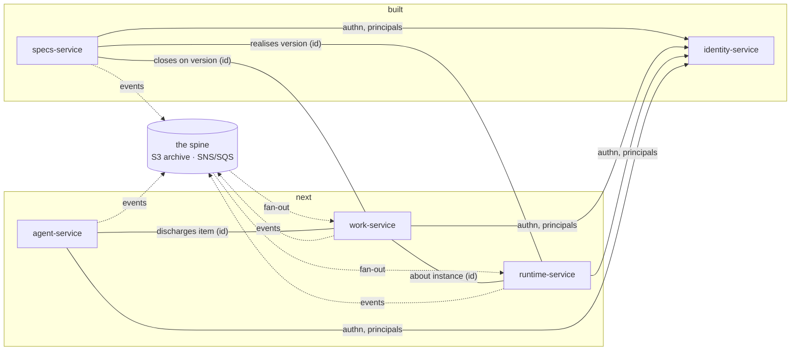
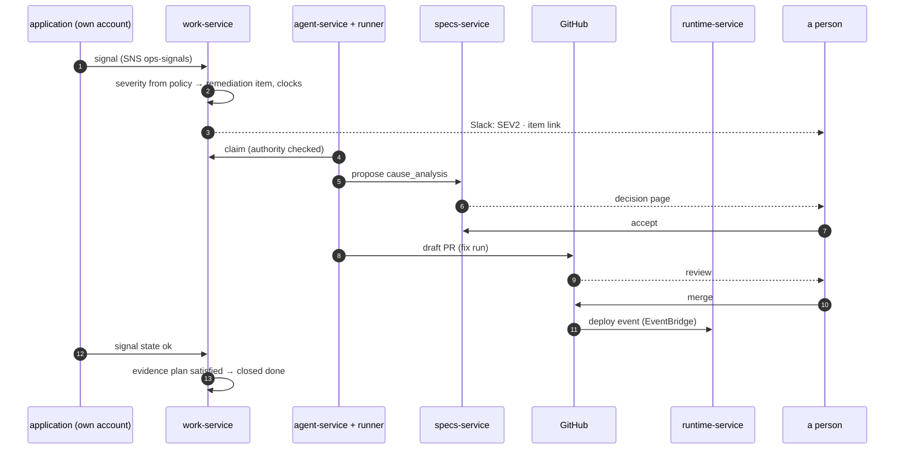
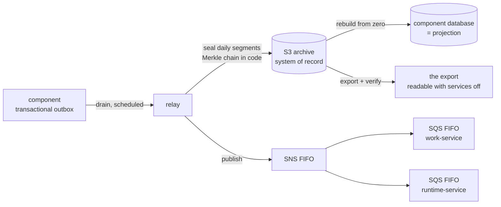
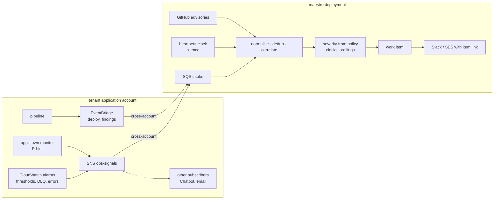

# Diagrams

Four figures, one claim each. Mermaid, rendered by GitHub.

## Figure 1 — The component map

Every component depends on identity-service and nothing else at runtime. Everything else is a port with a local default, or a reference by id.

Solid: a required call. Dotted: an event on the spine. Plain: a reference by id, no call.

## Figure 2 — Human-gated ops, use case 1

A person appears three times: to validate the analysis, to merge the fix, and — only when authority is short — to take the act the agent was refused.

## Figure 3 — The spine

The archive is the record; the queue is transport; every database is a projection.

## Figure 4 — The signals split

Detection where the knowledge is; response where the record is.

