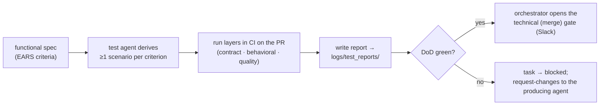

# Testing-agent protocol

How the **test agent** (US-0014) turns a functional spec into executable evidence inside maestro's
PR-based loop: it derives scenarios from the EARS acceptance criteria, runs the layered tests
(`standards/testing.yaml`), records timestamped evidence to `logs/test_reports/`, and feeds the
Definition-of-Done that gates the merge. Adapted from the foundry, re-anchored to maestro's
GitHub-PR + Slack-gate model.

## The loop

The test agent **does not move a story to Done** — `in-progress → done` is CI-only on the observed
merge (the status lifecycle is in [`sdlc.md`](sdlc.md) and surfaced on the workspace board). It
produces evidence; the architect decides at the gate.

## Deriving scenarios

- One functional spec → its **EARS acceptance criteria** are the contract (`standards/testing.yaml`
  `spec_adherence`). Each criterion gets **at least one** test.
- Scenarios are ordered by dependency; a platform-setup prerequisite (US-0001) runs first where
  another scenario needs it.

## The three layers

Run per `standards/testing.yaml` `agent_testing`:

| Layer | LLM | Gate |
|---|---|---|
| **contract** | mocked (the `mock_model`) | every PR — fast, deterministic |
| **behavioral** | real (via the `ModelClient`) | on merge to the default branch |
| **quality** | real + LLM-as-judge | scheduled / pre-release — advisory, alert on >10% regression |

The security/SBOM floors (`standards/security.yaml`) run alongside as part of the DoD and are
**never** relaxed.

## Evidence: `logs/test_reports/`

One timestamped markdown report per run, named `YYYY-MM-DD-HHMM-US-XXXX[-suffix].md`. Required
contents are defined in [`logs/test_reports/README.md`](../../logs/test_reports/README.md):

- run metadata (date, host, agent)
- a summary table — one row per scenario (✅ / ❌ / ⬜ skipped) + a one-line note on failures
- failure detail — for each fail: the step, expected vs actual, a log excerpt
- a status snapshot (the affected stories' lifecycle state) at end of run
- next actions — concrete, file-level

## Status lifecycle interaction

Per-story status lives in each story's `status:` frontmatter and is surfaced on the **workspace board**
(the UI — not a Markdown file). The rules that bind the test agent:

- `draft → accepted` is **human-only** (the architect locks scope) — the test agent never does this.
- `in-progress → done` is **CI-only on green merge** — never an agent or human claim.
- On a failing run, the test agent surfaces the task as **blocked** and links the report.

## When a scenario fails

1. Triage which layer failed (contract = plumbing/schema; behavioral = wrong behaviour on real LLM;
   quality = subjective regression).
2. Attach the report; **request-changes** returns the task to the agent that produced the artifact,
   carrying the failing criterion (per `sdlc.md`). Loop until green or rejected.
3. The merge gate opens only once all DoD layers are green again.
