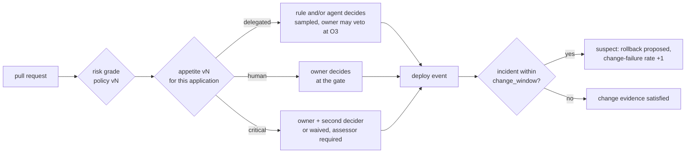

# Practices

Incident, problem and change management, and the practices around them, as maestro does them: agents do the work, and who decides — a person, a rule, or an agent — is chosen by risk and by the application's risk appetite. This is the design for **after the MVP** ([ADR-0022](decisions/0022-one-mvp-built-whole.md)). Nothing here is planned until the MVP's acceptance scenarios pass. Where a part needs a decision before it is built, the part says so.

**A practice is a lane, not a service.** Each practice is configuration and run kinds over the components maestro already has:
- work-service's classes and policy;
- specs-service's artifact types and gates;
- runtime-service's register;
- agent-service's runs.

No practice gets a table, a deployable or a console of its own. The three rules the MVP already enforces carry over unchanged:

1. **An agent decides only where a human delegated it.** Each application's **risk appetite** says who decides at each risk grade; a person accepts it, floors no appetite lowers bound it, and the accountable is always a human ([ADR-0031](decisions/0031-risk-appetite-delegates-decisions.md)).
2. **What matters is computed, never typed.** Severity is resolved from policy; so is a change's risk grade.
3. **Authority is refused, never warned.** It is checked at claim and again where the act lands ([governance-model.md](governance-model.md#authority-at-claim)).

## The practices, mapped

| Practice | What maestro already has | What the practice adds |
|---|---|---|
| **Incident** | signal → item with severity and clocks → claim → cause analysis at a gate → fix → evidence plan → close ([operations-model.md](operations-model.md#incident-lifecycle)); outages ([ADR-0028](decisions/0028-external-detection-and-correlated-outages.md)); a `review` after SEV ≤ 2 | an incident-lead seat; the change-induced link; stakeholder updates; push and on-call ([beyond-mvp.md](beyond-mvp.md#push-alerts)) |
| **Change** | the `change` class; the change-record artifact; merge ceiling O2; the three change-control kinds | the risk grade; standard, normal and emergency changes; freeze windows |
| **Problem** | the cause-analysis artifact | the problem record; known errors; the link from repeat incidents |
| **Configuration** | runtime-service's register and Estate; failure domains | dependencies between applications, for the blast radius |
| **Service level** | clocks, criticality tiers, the chase ladder | SLOs declared by the application; error budgets that feed the risk grade |
| **Request** | S1 and the `support` class; the intake agent ([beyond-mvp.md](beyond-mvp.md#the-intake-agent)) | nothing new |
| **Vulnerability** | the advisory lane and the fold ([use-cases.md](use-cases.md#uc1b--the-advisory-lane)) | nothing new |
| **Knowledge** | specs-service artifacts, versioned and gated | runbooks as an artifact type; a run's plan cites the runbook version it follows |
| **Audit** | the archive: every act attributed, with its oversight level and accountable human | nothing. It is already the record every practice writes to |

## Incident

**An incident is a work item, not a record of its own.** It is the `remediation` item a signal raises, or the outage item a failure domain raises. The MVP's lifecycle stands. The practice adds four things.

- **The incident lead.** A seat on SEV1 and SEV2 items, always a human (O0). The lead:
  - owns communication and the decision to escalate;
  - may differ from `accountable`, who does not move.
- **The change-induced link.** An incident raised on an application within `change_window` of a deploy to it, or to a member of its failure domain, names that deploy as **suspect**. runtime-service already holds the deploy and its known-good rollback target. Rolling back is a restore-class act (N1), so the triager can propose it at once. The link is deterministic; the cause analysis confirms or clears it. The rate of confirmed links per application is its **change-failure rate**, which feeds the risk grade.
- **The timeline.** Built from the archive, not written up afterwards. Every signal, claim, act, refusal and decision on the item and its attached signals is already an event.
- **Stakeholder updates.** Drafted by the scribe from the timeline at a cadence set by severity, and sent by the lead. Sending needs a push channel, which is backlog.

## Problem

**A problem is an artifact in specs-service**: a new type, configured, not coded. Its facets:
- the incidents it explains;
- its cause;
- its workaround;
- the change that removes it.

- **Raised.** The problem analyst proposes a problem when incidents on one application repeat: same fingerprint, same failure domain, or same suspect change. The threshold is policy. The analyst drafts; a person accepts at the problem gate.
- **Known error.** An accepted problem version with a workaround. The triager matches new incidents against known errors and cites the version in its plan.
- **Removal.** Removing a problem is a `change` item pinned to the problem's version. The problem closes when that change's evidence plan is satisfied and no matching incident recurs within `recurrence_window`.

## Change

### The risk grade

**Every change is graded when it is proposed and graded again at merge.** Where the act lands, the grade taken at merge is the one that counts. The grade is a **policy function the tenant versions**, not a judgment. Its inputs:

| Input | From |
|---|---|
| change kind (cosmetic, behavioural, assumption-breaking), bump level, paths touched against CODEOWNERS and declared sensitive paths, size | the pull request |
| CI status, whether the change can be reverted | the pull request, runtime-service's rollback target |
| consequence class, criticality tier, onboarding level | runtime-service |
| blast radius: the applications and tiers that share its failure domain or depend on it | work-service's definition, runtime-service's register |
| change-failure rate, incidents open or recent on the application | work-service |
| error budget remaining | the application's SLO signal |
| inside a freeze window | policy calendar |

**Four grades; the application's risk appetite routes each** ([ADR-0031](decisions/0031-risk-appetite-delegates-decisions.md)). The grade is computed; the appetite, a versioned artifact the application's owner accepts, says who decides at it. The ceilings in [governance-model.md](governance-model.md#ceilings) still cap every route, and the onboarding level bounds the appetite: an N1 application delegates no change decision.

| Grade | cautious | balanced (default) | delegating |
|---|---|---|---|
| **low** — standard change, e.g. "patch bump, CI green, N2, consequence ≤ c2" | owner | the rule approves and the change assessor concurs; either objecting sends it to the owner. O4, sampled | an agent run decides. O4, sampled |
| **medium** | owner | an agent run decides; the owner may veto before effect (O3) | an agent run decides (O3) |
| **high** | owner | owner | owner |
| **critical** | owner + second decider | owner; second decider optional | owner; second decider optional |

- **The appetite permits; the seat earns.** An agent reaches a delegated level by promotion on this application, and loses it at once on demotion.
- **A waived second decider is recorded** on the decision (`waived under appetite vN`). At critical the change assessor's review is then required, and deciding against its objection records the override.
- **Inside a freeze window**, only the freeze's exception decider, a person, decides, whatever the grade.
- **An agent never decides on its own work.** The deciding run is not the run that opened the change.

**The grade tightens itself.** A confirmed change-induced incident, a spent error budget or a freeze window raises the grade of the application's next changes by one step, until the condition clears. This follows the governance model's demotion rule: faster to tighten than to loosen, and effective on the next change.

### Emergency changes

**An emergency change acts first and is decided after.** First, a restore-class act under N1 authority (a rollback, a failover, a flag) needs no change gate. Beyond that:
- a code change during an incident is still merged by a person (the merge ceiling is O2), without waiting for the normal gate's queue;
- every emergency change raises a `review` item due within `emergency_review_by` (policy, default 24 hours);
- that review accepts or reverts the change at the gate it skipped.

No change advisory board. The decision page is the board, and the grade decides who sits at it.

## Service level

**The application declares its SLOs, as it owns its alarms** ([ADR-0012](decisions/0012-the-application-owns-detection-maestro-owns-response.md)). maestro reads their burn as signals:
- a burn alarm raises an item like any alarm;
- remaining budget is an input to the risk grade.

A spent budget does not freeze change. It raises the grade, so a decision the appetite delegated at the old grade may go to a person at the new one.

## Agents

One roster. Each role is a run kind under [agent-service](components/agent-service.md)'s runner, with a fixed seat and a ceiling no promotion lifts.

| Run kind | Does | Produces | Ceiling |
|---|---|---|---|
| **triager** | classifies an incoming item, matches known errors, names a suspect change, proposes a severity change | a triage note on the item; a reclassification a person confirms | O4 for classification; O2 for a severity change |
| **diagnostician** | reads logs, alarms, the timeline and the suspect diff | a cause-analysis draft | O2: a person accepts it |
| **remediator** | takes the restore act, or opens the fix | a rollback or failover; a pull request | restore: O4 at N1; patch and code: its grade's route at N2 |
| **change assessor** | explains the grade the policy gave; flags inputs the policy could not read; concurs or objects; decides where the appetite delegates the grade | a note on the decision page; a verdict | O1 for the grade: it never changes it. Its verdict: the appetite's level, reached by promotion |
| **scribe** | keeps the timeline readable; drafts stakeholder updates and the review's first draft | drafts | O1: the lead sends, the owner accepts |
| **problem analyst** | clusters repeat incidents; drafts problems and known errors | a problem draft | O2: a person accepts it |

**Deterministic first, agents second.** Correlation, the suspect link, the risk grade and known-error matching are rules: replayable, versioned, auditable. An agent does what a rule cannot: read, explain, draft, propose.

## Always a person

| Gate | Why |
|---|---|
| accepting a cause analysis, a problem, a known error | what the fix and the next triage are built on |
| a change graded high or critical, or any grade the appetite does not delegate | the appetite says a person decides |
| setting or loosening an application's risk appetite, and a freeze exception | the rule that lets anything else decide is itself a decision |
| confirming a severity change | it resets every clock |
| accepting an emergency change after the fact | it skipped its gate |
| the incident lead | communication and escalation are judgment |
| changing the risk policy | the grade every route reads is itself a decision |

## Order after the MVP

1. **Risk-graded change routing** ([beyond-mvp.md](beyond-mvp.md#risk-graded-change-routing)), with the change-induced link. The inputs mostly exist; the link is one join between runtime-service and work-service.
2. **Problems and known errors.** An artifact type, the problem analyst, and known-error matching in the triager.
3. **Service levels and push.** SLOs feeding the grade; the incident lead and stakeholder updates, once maestro can reach a person who is not looking.
4. **Dependencies in the register**, so the blast radius is more than a failure domain.

## To decide before building

- **The change window and the suspect link across a failure domain.** Recommended: policy value, default 60 minutes, and the domain counts. A deploy to one member is suspect for an incident on another.
- **Whether a problem is an artifact or a work item.** Recommended: an artifact, because it is agreed and versioned. The work to remove it is an item pinned to it.
- **Where dependencies are declared.** Recommended: runtime-service's register, next to failure domains once they move there ([ADR-0028](decisions/0028-external-detection-and-correlated-outages.md), asked 1).
