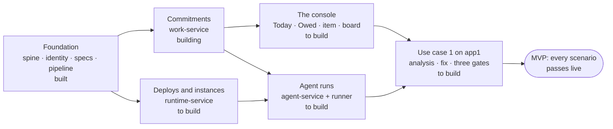

# Roadmap: the build to the MVP

**One target: the MVP, built whole** ([ADR-0022](decisions/0022-one-mvp-built-whole.md)). It is done when every [acceptance scenario](#acceptance) below passes live on the first tenant. Until then nothing is released to anyone. What runs on the first tenant is the build being assembled and tested. The [build list](#the-build-list) says what reaches the scenarios, in the order things depend on each other.

## Acceptance

Each scenario is run on the first tenant (fps4's own deployment, [first-deployment.md](first-deployment.md)). A scenario that passed earlier is run again before the MVP is called done. "In code" means it passes as a test against the local stack, and the live run is still to come.

| # | Scenario | Where it comes from | State |
|---|---|---|---|
| **The record** | | | |
| R1 | A component's outbox relays to the archive and the events topic; a consumer queue receives them in order per workspace. | [spine](components/spine.md#acceptance) | passed live 2026-09-22 (specs-service) |
| R2 | A workspace's table is dropped and rebuilt from the archive alone; every read returns identically. | [spine](components/spine.md#acceptance) | passed live 2026-09-22 (specs-service); in code for work-service |
| R3 | The verifier, run from a laptop with every service off, passes on a sealed range and names the first divergent `seq` on a tampered copy. | [spine](components/spine.md#acceptance) | passed live 2026-09-22 |
| R4 | An event with an agent in `accountable`, or an identity-provider subject anywhere, is rejected at append. | [spine](components/spine.md#acceptance) | in code |
| **Commitments** | | | |
| W1 | An item is raised, assigned, closed with an outcome, and read back identically after a rebuild from the archive. | [work-service](components/work-service.md#acceptance) | in code |
| W2 | A patch-class claim on an N1 application is refused at claim, closes `escalated_out`, and the rate is one call. | [work-service](components/work-service.md#acceptance) | in code |
| W3 | A deadline-bearing item chases, escalates and breaches on schedule; every step's delivery is recorded. | [work-service](components/work-service.md#acceptance) | in code |
| W4 | An agent's lease expires and the item returns to `open` with a reason; `accountable` never changes. | [work-service](components/work-service.md#acceptance) | in code |
| W5 | **The advisory lane with no agent:** advisory → item → Dependabot's PR → a person's merge → deploy event → re-scan → closed `done` on evidence. Medium and low findings fold into one weekly obligation. | [use-cases.md](use-cases.md#uc1b--the-advisory-lane) | in code; the live run waits on intake and the fixture application (build list) |
| W6 | A skill written against the tracker contract runs its acceptance suite green against the MCP server. | [work-service](components/work-service.md#acceptance) | in code |
| **Deploys and instances** | | | |
| T1 | A deploy event creates the artifact and the instance; a second deploy shifts `rollback_target`; a rebuild from the archive is identical. | [runtime-service](components/runtime-service.md#acceptance) | to build |
| T2 | A deploy of a digest with no build record raises `DigestMismatchDetected` and a SEV item; the instance is marked, never silently corrected. | [runtime-service](components/runtime-service.md#acceptance) | to build |
| T3 | `carries(dependency)` returns every deployed instance whose SBOM names it. | [runtime-service](components/runtime-service.md#acceptance) | to build |
| **Agent runs** | | | |
| A1 | A bump goes red in CI. A `bump` run claims the item and makes the test pass. Every step, the plan and the next human touchpoint are visible while it runs, and the transcript is readable afterwards by the reader role only. | [agent-service](components/agent-service.md#acceptance) | to build |
| A2 | A green patch-level bump on an N2 application merges under the agent's ceiling. | [use-cases.md](use-cases.md#uc1b--the-advisory-lane) | to build |
| A3 | A run that attempts an act outside its ceiling records `ActionRefused` with the check named. | [agent-service](components/agent-service.md#acceptance) | to build |
| A4 | The runner's state is dropped; every run's history reads back from the archive and the transcript store. | [agent-service](components/agent-service.md#acceptance) | to build |
| A5 | One run in N lands in a person's review queue; the floor cannot be set to zero. | [agent-service](components/agent-service.md#acceptance) | to build |
| **Use case 1 on app1** | | | |
| U1 | An injected failure in staging becomes a SEV item, an accepted analysis, a merged fix and a closed item, with a person at the [three gates](use-cases.md#uc1--human-gated-ops-on-a-serverless-application) and nowhere else. | [use-cases.md](use-cases.md#uc1--human-gated-ops-on-a-serverless-application) | to build |
| U2 | A person accepts a cause analysis on a phone, in two minutes, without asking anyone. | [ux.md](ux.md) | to build |

## The build list

What reaches the scenarios, by part. **Built** means in code and deployed on the first tenant. **Building** means in code, with some of it not yet deployed or not yet live. **To build** means not started.

### Foundation: built

The spine (core, the S3 and SNS adapters, the sealer, its Terraform module, on npm as `@fps4/maestro-spine`). The tenant pipeline ([ADR-0017](decisions/0017-the-tenant-repository-runs-the-pipeline.md)). The signals module (`signals/`). The console module (`console/`). identity-service's module, relay, lifecycle events and set-password links. specs-service's envelope, payload store, rebuilder, module, `workspace:member`, and the `prn` claim read with `principal:adopt`. All on DynamoDB ([ADR-0018](decisions/0018-dynamodb-is-the-mvp-database.md)). The first tenant was applied through its pipeline on 2026-09-22, and R1–R3 passed there.

What the first live run found and fixed: two IAM grants DynamoDB Local could not check, the specs relay dying at boot without the store's name, a workspace definition in an earlier shape, a first human with no way to a password of their own, and no operator command to admit a member.

| Still to build | |
|---|---|
| The consoles' OpenNext bundles | the console module deploys what a build produces; no console builds one yet |
| The Secrets Manager extension in place of secret values in Terraform state | values in state are accepted until then (ADR-0017); the extension lands before the GitHub App's key, with agent runs |
| identity-service: an enumeration endpoint for a realm's principals, for the registry to reconcile | small |

### Commitments (work-service): building

| Part | State |
|---|---|
| The item: six classes, the state machine, authority at claim, policy clocks, ceilings, chase ladders, leases, the sweep | built |
| Evidence plans; signals intake (dedup, the weekly fold); the GitHub, SNS and EventBridge adapters | in code; deployed with intake switched off |
| The frontier, the board, Today (API); `blocking`; MCP with the tracker contract | in code (maestro #32), not yet deployed |
| Alerts: each chase step, escalation and breach marked on the person's Today ([ADR-0023](decisions/0023-maestro-alerts-in-its-one-console.md)) | the steps are recorded; Today's marks to build |
| Intake switched on for the first tenant: its workload principal, the webhook secret, a GitHub webhook per observed repository, Dependabot security updates on | to build |
| A fixture application the first tenant owns and observes, in its tenant repository: a pinned dependency with a published high advisory, and its own deploy workflow | to build |
| Deploy events from each application's own pipeline: a role the tenant grants per repository (`events:PutEvents`, source `maestro.deploy`) | to build |
| [work-service.md](components/work-service.md) brought level with what was built: the policy's shape, `steward`, ladder timing, streams, and the interpretations confirmed at merge (evidence arming, `blocked_by`, Today's split) | to build |

### Deploys and instances (runtime-service): to build

The artifact ledger and the instance register, fed by deploy events ([ADR-0011](decisions/0011-the-instance-register-is-one-deployable.md)). Scan intake from ECR and Inspector. `carries(dependency)` over the SBOMs. Tier and onboarding level move here from work-service's workspace definition. `deploy_event` evidence is then matched by digest rather than by time.

### The console: to build

One console per deployment, growing from specs-service's (`specs/web`), with every surface in [ux.md](ux.md) ([ADR-0023](decisions/0023-maestro-alerts-in-its-one-console.md)). To build: Today (decide, answer, owed, agents at work, with the alert marks), Owed (the frontier), the work item and the board; then the run page and the estate. Its OpenNext bundle, deployed through `console/terraform`, is the foundation item above.

### Agent runs (agent-service and the runner): to build

The record half first ([ADR-0008](decisions/0008-agent-service-record-half-first.md)), then the run-event contract, the GitHub Actions runner with Claude Code under an agent principal, transcript custody in S3, the run page and the sampling queue. The `maestro-skills` Claude Code plugin. Before the runner is built, an ADR picks the model the runner drives and its effort per run: one default model (Opus 5.5 is the candidate), with effort set by seat and consequence class, e.g. `rca` high, `bump` low.

### Use case 1 on app1: to build

CloudWatch, EventBridge and app1's own monitor as signal sources. The `cause_analysis` type and its gate in specs-service. The RCA and fix run kinds. Evidence resolved from events. The console and MCP reached at a domain of the tenant's, not the platform's hostnames. app1 onboarded at N2.

## Decided on the way

| Decision | Where |
|---|---|
| maestro alerts in its console only; applications keep their own paging; one console per deployment | [ADR-0023](decisions/0023-maestro-alerts-in-its-one-console.md) |
| The advisory lane's fix is Dependabot's pull request; a `bump` run only when it goes red (A1) | [use-cases.md](use-cases.md#uc1b--the-advisory-lane), confirmed 2026-09-26 |
| The live advisory lane (W5) runs on a fixture application the first tenant owns, kept in its tenant repository | 2026-09-26 |
| A deploy event is put by the application's own pipeline | [signals.md](signals.md), confirmed 2026-09-26 |
| No GitHub issue mirrors a work item: the item is the record, and GitHub is not. A mirror would be a notifier adapter, after the MVP | [use-cases.md](use-cases.md#uc1--human-gated-ops-on-a-serverless-application), 2026-09-26 |
| The console and MCP are reached at the platform's hostnames while the MVP is built, and at a domain of the tenant's before app1 is onboarded | 2026-09-26 |
| Secret values may sit in Terraform state while the MVP is built; the Secrets Manager extension replaces them before the GitHub App's key arrives | [ADR-0017](decisions/0017-the-tenant-repository-runs-the-pipeline.md), 2026-09-26 |
| What work-service's pull requests asked to confirm (ladder timing, `steward`, evidence arming, `blocked_by`, Today's split) stands as proposed: accepted at merge | 2026-09-26 |

## Open decisions

None. A new one is added here, with a recommendation, when it comes up.

## After the MVP

The [backlog](beyond-mvp.md): the Slack intake agent and customer-facing tenants. The regulated branch forks from the finished MVP on the [four seams](mvp.md#four-seams-kept-open).
