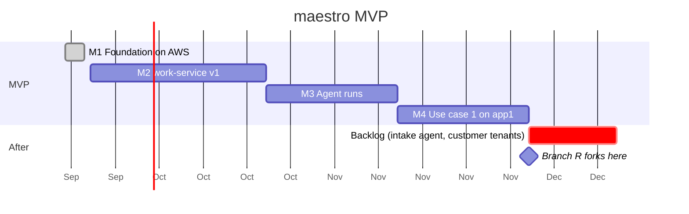

# Roadmap

Four milestones. Each ends at a gate you can watch happen, not a feature list you can tick. Order follows which gaps each [use case](use-cases.md) needs. Durations are rough, for one architect with agents.

## M1 · Foundation on AWS (2026-09-19 → 2026-09-22, closed)

**Builds:** Terraform modules for identity-service and specs-service on Lambda, each with its DynamoDB table ([ADR-0018](decisions/0018-dynamodb-is-the-mvp-database.md)); the S3 archive relay and SNS/SQS delivery; the reusable tenant workflow and `deploy.sh`; GitHub-hosted CI; the [signals module](signals.md) — its Terraform half published from the repository, its CDK construct in the repository until the first CDK application publishes it; the self-hosted runner pool retired for these repositories.

**Gate:** specs-service serves from AWS. A workspace's database is dropped and rebuilt from the archive alone. The verifier checks the chain with the service off.

**Closed 2026-09-22.** Every build item is in code and merged: the spine (core, S3/SNS, sealer, Terraform module with a LocalStack stand-in — `spine/`, on npm as `@fps4/maestro-spine` by trusted publishing), the tenant pipeline ([ADR-0017](decisions/0017-the-tenant-repository-runs-the-pipeline.md): `tenant-deploy.yml`, `scripts/deploy.sh`), the signals module (`signals/`), the console module (`console/`), identity-service's module, relay, lifecycle events and set-password links, specs-service's envelope, payload store, rebuilder, module and `workspace:member` — all on DynamoDB after [ADR-0018](decisions/0018-dynamodb-is-the-mvp-database.md) moved the record store before the gate. The first tenant is fps4's own deployment (`maestro-config-fps4`, a private repository), applied through its pipeline by the deploy role through OIDC, 87 resources in one apply; maestro's own services are its first applications.

The gate ran on that deployment on 2026-09-22, every step as [first-deployment.md](first-deployment.md) now records it:

1. **Gate 1 — passed.** A human, seeded and holding a password through a set-password link, admitted to the tenant's workspace by a membership, proposed an intake assessment and decided it at a gate through the specs API. The relay landed the three events (`VersionProposed`, `EvaluationRecorded`, `DecisionRecorded`, seats author, reviewer, decider) in the archive within the minute; a FIFO queue subscribed to the events topic received them in order.
2. **Gate 2 — passed.** After the day was sealed (the sealer run under the operator's credentials with the next day as its clock, as the schedule would at 00:07 UTC), the workspace was dropped and rebuilt from the archive and the payload store alone; 315 lines of reads — the artifact, the version, the gate's view, the register — identical before and after.
3. **Gate 3 — passed.** Every function at zero concurrency, the workspace's archive prefix synced to a laptop, `spine-verify`: `pass ws-fps4-ops seq 1–3 1 segment(s)`.

What the gate found and fixed on the way: two IAM grants DynamoDB Local could not check (`ConditionCheckItem`, `DescribeTimeToLive` — both modules now hold their grant to the commands the code sends), the specs relay dying at boot without the store's name, a workspace definition in an earlier shape, the first human with no way to a password of their own, and no operator command to admit a member. Carried to M2: specs-service reads the `prn` claim identity-service mints (today each component mints its own id for one human — done in `maestro-specs` PR #26, the first tenant's human adopted with its `principal:adopt`); the consoles' OpenNext bundles; the Secrets Manager extension in place of values in state.

## M2 · work-service v1 (~4 weeks)

**Builds:** the work item envelope and six classes; policy (severity × tier → clocks; ceilings per agent per class; chase ladders); authority checked at claim; evidence plans; signals intake with SNS, EventBridge and GitHub adapters; Slack and SES notifier adapters; the frontier and the board with milestone and application filters; MCP with the tracker contract (publish / fetch / claim / resolve / frontier / blocking) as the acceptance test; "Today".

**Gate:** the [advisory lane](use-cases.md#uc1b--the-advisory-lane) end to end without an agent — advisory → item → Dependabot's PR → a person's merge → deploy event → re-scan → closed `done` on evidence. A patch-class claim on an N1 application is refused and counted. Medium and low findings fold into one weekly obligation.

## M3 · Agent runs (~3 weeks)

**Builds:** agent-service, record half; the run-event contract; the GitHub Actions runner with Claude Code under an agent principal; transcript custody in S3; the run page; the sampling queue.

**Decides first:** the model the runner drives and its effort level per run — one default model (Opus 5.5 is the candidate) with effort set by seat and consequence class (e.g. `rca` high, `bump` low); an ADR before the runner is built.

**Gate:** a bump goes red in CI; a `bump` run claims the item, makes the test pass, and every step, the plan and the next human touchpoint are visible while it runs. A green patch-level bump on an N2 application merges under the agent's ceiling. One run in N lands in a person's review queue.

## M4 · Use case 1 on app1 (~3 weeks)

**Builds:** CloudWatch, EventBridge and app1's own monitor as signal sources; the `cause_analysis` type and its gate in specs-service; RCA and fix run kinds; runtime-service fed by EventBridge deploy events; evidence resolved from events; app1 onboarded at N2.

**Gate:** an injected failure in staging becomes a SEV item, an accepted analysis, a merged fix and a closed item — with a person at [three gates](use-cases.md#uc1--human-gated-ops-on-a-serverless-application) and nowhere else.

## After the MVP

The [backlog](beyond-mvp.md): the Slack intake agent, customer-facing tenants. The regulated branch forks after M4 on the [four seams](mvp.md#four-seams-kept-open).
