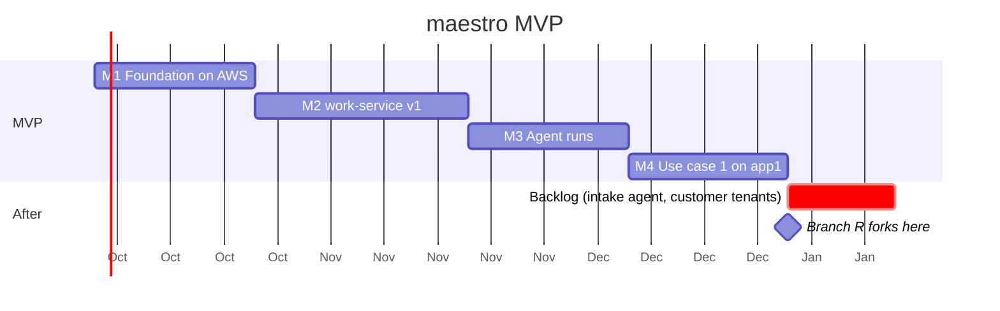

# Roadmap

Four milestones. Each ends at a gate you can watch happen, not a feature list you can tick. Order follows which gaps each [use case](use-cases.md) needs. Durations are rough, for one architect with agents.

## M1 · Foundation on AWS (~3 weeks)

**Builds:** Terraform modules for identity-service and specs-service on Lambda; Atlas Flex; the S3 archive relay and SNS/SQS delivery; the reusable tenant workflow and `deploy.sh`; GitHub-hosted CI; the [signals module](signals.md) (Terraform + CDK construct) published; the self-hosted runner pool retired for these repositories.

**Gate:** specs-service serves from AWS. A workspace's database is dropped and rebuilt from the archive alone. The verifier checks the chain with the service off.

## M2 · work-service v1 (~4 weeks)

**Builds:** the work item envelope and six classes; policy (severity × tier → clocks; ceilings per agent per class; chase ladders); authority checked at claim; evidence plans; signals intake with SNS, EventBridge and GitHub adapters; Slack and SES notifier adapters; the frontier and the board with milestone and application filters; MCP with the tracker contract (publish / fetch / claim / resolve / frontier / blocking) as the acceptance test; "Today".

**Gate:** the [advisory lane](use-cases.md#uc1b--the-advisory-lane) end to end without an agent — advisory → item → Dependabot's PR → a person's merge → deploy event → re-scan → closed `done` on evidence. A patch-class claim on an N1 application is refused and counted. Medium and low findings fold into one weekly obligation.

## M3 · Agent runs (~3 weeks)

**Builds:** agent-service, record half; the run-event contract; the GitHub Actions runner with Claude Code under an agent principal; transcript custody in S3; the run page; the sampling queue.

**Gate:** a bump goes red in CI; a `bump` run claims the item, makes the test pass, and every step, the plan and the next human touchpoint are visible while it runs. A green patch-level bump on an N2 application merges under the agent's ceiling. One run in N lands in a person's review queue.

## M4 · Use case 1 on app1 (~3 weeks)

**Builds:** CloudWatch, EventBridge and app1's own monitor as signal sources; the `cause_analysis` type and its gate in specs-service; RCA and fix run kinds; runtime-service fed by EventBridge deploy events; evidence resolved from events; app1 onboarded at N2.

**Gate:** an injected failure in staging becomes a SEV item, an accepted analysis, a merged fix and a closed item — with a person at [three gates](use-cases.md#uc1--human-gated-ops-on-a-serverless-application) and nowhere else.

## After the MVP

The [backlog](beyond-mvp.md): the Slack intake agent, customer-facing tenants. The regulated branch forks after M4 on the [four seams](mvp.md#four-seams-kept-open).
